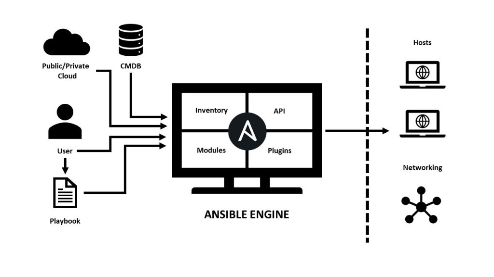

<a href="https://github.com/nirgeier/AnsibleLabs/actions/workflows/Lab-003.yaml" target="_blank">
  
</a>

---

# Lab 003 - Commands & Modules

- In this section, we will cover the **Modules**.
- **Modules** are important elements and act as the "heart" of `Ansible`.




### Pre-Requirements

- Complete the [previous lab](../002-no-inventory#usage) in order to have a working `Ansible` controller and inventory configuration.

---

### 01. What is a module?

- A module is a unit of code in `Ansible` that performs **common operations in infrastructure management** (such as configuring systems, installing software and managing resources). 
- `Ansible` has a **huge** number of modules. 
- You can browse and search `Ansible` builtin modules in the [Builtin Ansible modules](https://docs.ansible.com/ansible/latest/collections/ansible/builtin/index.html#modules).
- Module are used for task automation.

---

### 02. A sample module

- In this lab we will explore the builtin `ping` module.
- You can read about this module in the [Ansible documentation](https://docs.ansible.com/ansible/latest/collections/ansible/builtin/ping_module.html).
- You can find the source code for this module in [Builtin ping module repo](https://github.com/ansible/ansible/blob/devel/lib/ansible/modules/ping.py).

---

### 03. The ping module 


  
  > **From the docs:**
  > 
  > - *ansible.builtin.ping* module – *Try to connect to host, verify a usable python and return pong on success*
  > - *This module is part of ansible-core and included in all Ansible installations.*
  > - *In most cases, you can use the short module name `ping`*


- Now, as we break down the code, feel free to browse and look at the full code.

---

### 04. The ping source code

- At the time of writing this tutorial, the "implementation" of the `ping` module is as follows:
```python
RETURN = '''
ping:
    description:  Value provided with the O(data) parameter.
    returned:     success
    type:         str
    sample:       pong
'''

from ansible.module_utils.basic import AnsibleModule

def main():
    module = AnsibleModule(
        argument_spec=dict(
            data=dict(type='str', default='pong'),
        ),
        supports_check_mode=True
    )

    if module.params['data'] == 'crash':
        raise Exception("boom")

    result = dict(
        ping=module.params['data'],
    )

    module.exit_json(**result)

if __name__ == '__main__':
    main()
```

---

## 05. List of modules

- Modules are managed in the form of `collections`, as each `collection` contains multiple related modules. 
- See here for a [List of Collections](https://docs.ansible.com/ansible/latest/collections/index.html).

!!! warning "Note"   
    Up to version 2.9, `Ansible` included **all modules** by default, 
    but as the number of modules increased tremendously, it has been changed to the current format (ver. 2.10 and later).

---

## 06. Using modules

- By default `Ansible` is installed with `ansible.builtin` as the only collection. 
- [Click here](https://docs.ansible.com/ansible/latest/collections/ansible/builtin/index.html#modules) for a list of modules that are available in the `ansible.builtin`.

---

## 07. Find modules for your OS

- To see which modules are available for your OS, use the following command:
  ```sh
  ansible-doc -l

  ### Output (only first few lines)
  add_host        Add a host (and alternatively a group) to the ansible-playbook in-memory inventor...
  apt             Manages apt-packages
  apt_key         Add or remove an apt key
  apt_repository  Add and remove APT repositories
  assemble        Assemble configuration files from fragments
  assert          Asserts given expressions are true
  async_status    Obtain status of asynchronous task
  blockinfile     Insert/update/remove a text block surrounded by marker lines
  ```

---

## 08. Documentation

- To view documentation for a specific module, use the following command:
  ```sh
  # Display the ping documentation
  $ ansible-doc ping

  ### Output (only first few lines)
  > ANSIBLE.BUILTIN.PING    (/opt/homebrew/Cellar/ansible/9.4.0_1/libexec/lib/python3.12/site-packages/ansible/modules/ping>

        A trivial test module, this module always returns `pong' on successful contact. It does
        not make sense in playbooks, but it is useful from `/usr/bin/ansible' to verify the
        ability to login and that a usable Python is configured. This is NOT ICMP ping, this is
        just a trivial test module that requires Python on the remote-node. For Windows targets,
        use the [ansible.windows.win_ping] module instead. For Network targets, use the
        [ansible.netcommon.net_ping] module instead.

  ADDED IN: historical

  OPTIONS (= is mandatory):

  - data
        Data to return for the `ping' return value.
  ```

---

## 09. Common ad-hoc commands

- Invoking a module is referred to as an `ad-hoc command`.
- The syntax of an `ad-hoc command` is as follows:
  ```sh
  $ ansible <servers> -m <module_name> -a '<parameters>'
  ```
   
    | CLI option                 | Description                 |
    | -------------------------- | --------------------------- |
    | `<servers>`                | Any server (single, group or all) as defined in the inventory file |
    | `-m <module_name>`         | Specifies the module name  |
    | `-a <parameters>`          | Specifies the parameters to be passed to the module. Optional in most cases    |
    
---

## 10. `Ping` usage

- We are already familiarized with the [ping module](https://docs.ansible.com/ansible/latest/collections/ansible/builtin/ping_module.html). 


!!! warning "Tips"   
    - The `ping` module is a module that determines whether Ansible can "communicate as Ansible" with the node it is working on (which is different from ICMP used in the network). 
    - The `ping` module parameters are optional.


- Usage:
 
```sh
  # Ping all server in the inventory
  ansible all -m ping

  # In our demo lab we will execute it, as follows:
  docker exec ansible-controller sh -c "cd /labs-scripts && ansible all -m ping"
  

  ### Output
  linux-server-1 | SUCCESS => {
      "ansible_facts": {
          "discovered_interpreter_python": "/usr/bin/python3"
      },
      "changed": false,
      "ping": "pong"
  }
  linux-server-3 | SUCCESS => {
      "ansible_facts": {
          "discovered_interpreter_python": "/usr/bin/python3"
      },
      "changed": false,
      "ping": "pong"
  }
  linux-server-2 | SUCCESS => {
      "ansible_facts": {
          "discovered_interpreter_python": "/usr/bin/python3"
      },
      "changed": false,
      "ping": "pong"
  }
```

---

## 11. The `shell` module

- This is a module that executes shell commands on targets' nodes.
- See `Ansible` [documentation about the `shell` module](https://docs.ansible.com/ansible/latest/collections/ansible/builtin/shell_module.html).

!!! warning "TIP"
    Be cautious when using the `shell` module, as it can introduce security risks if not used properly. Always validate and sanitize any user input that may be passed to shell commands.


  ```sh
  # Let's get the hostname of the server
  ansible all -m shell -a 'hostname'

  # In our demo lab we will execute it like this:
  docker exec ansible-controller sh -c "cd /labs-scripts && ansible all -m shell -a 'hostname'"
  
  # Output
  # ansible all -m shell -a 'hostname' 
  linux-server-3 | CHANGED | rc=0 >>
  linux-server-3
  linux-server-2 | CHANGED | rc=0 >>
  linux-server-2
  linux-server-1 | CHANGED | rc=0 >>
  linux-server-1
  ```

---


## 12. Hands-on

01. Figure out a way to run the following (shell) command with `Ansible`, on any of the servers:
  
    ```sh
    # Get kernel information
    uname -a

    # Get a date
    date
    ```

02. Use the Ansible `command` module to print out the previous shell commands.

03. Try to run the following command: 
```sh
git config -l
```
  What is the result of this command?

## 13. Solution

  <details>
    <summary>uname -a</summary>
    
    ```sh
    # Using the shell module
    docker exec ansible-controller sh -c "cd /labs-scripts && ansible linux-server-1 -m shell -a 'uname -a'"

    #Using the ansible `command` module
    docker exec ansible-controller sh -c "cd /labs-scripts && ansible linux-server-1 -m command -a 'uname -a'"
    ```
  </details>

  <details>
    <summary>date</summary>
    
    ```sh
    # Using the shell module
    docker exec ansible-controller sh -c "cd /labs-scripts && ansible linux-server-1 -m shell -a 'date'"

    #Using the ansible `command` module
    docker exec ansible-controller sh -c "cd /labs-scripts && ansible linux-server-1 -m command -a 'date'"
    ```
  </details>

  <details>
    <summary>previous shell commands</summary>
    
    ```sh
    docker exec ansible-controller sh -c "cd /labs-scripts && ansible all -m command -a 'uname -a'"
    docker exec ansible-controller sh -c "cd /labs-scripts && ansible all -m command -a 'date'"
    ```
  </details>

  <details>
    <summary>git config</summary>

    ```sh
    # The command
    git config -l

    ### Output
    user.name=Your Name
    user.email=your.email@example.com
    core.repositoryformatversion=0
    core.filemode=true
    core.bare=false
    ```
  </details>


