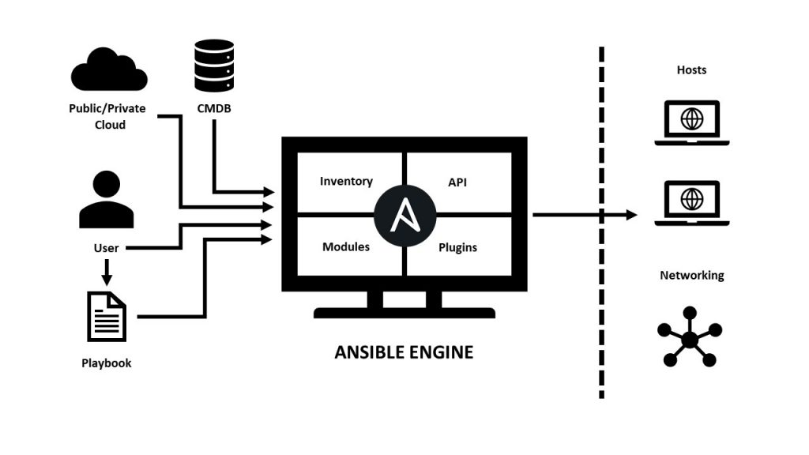

---

# Commands & Modules

* In this section, we will cover the **Modules**.
* **Modules** are important elements and act as the "heart" of `Ansible`.
* 

## What will we learn?

- What Ansible modules are and how they work
- How to use ad-hoc commands with modules
- How to use the `ping`, `shell`, `copy`, `file`, and `apt` modules
- How to find and read module documentation

---

## Prerequisites

- Complete the [previous lab](../002-no-inventory/README.md#usage) in order to have a working `Ansible` controller and inventory configuration.

---

## 01. What is a module?

- A module is a unit of code in `Ansible` that performs **common operations in infrastructure management** (such as configuring systems, installing software and managing resources).
- `Ansible` has a **huge** number of modules (over 3,000+ built-in modules).
- You can browse and search `Ansible` builtin modules in the [Builtin Ansible modules](https://docs.ansible.com/ansible/latest/collections/ansible/builtin/index.html#modules).
- Modules are used for task automation and can be executed directly via ad-hoc commands or within playbooks.
- Each module is **idempotent** by design - running it multiple times produces the same result without unwanted side effects.

#### Common Module Categories:

| Category       | Examples                                                 | Use Cases                            |
| -------------- | -------------------------------------------------------- | ------------------------------------ |
| **System**     | `user`, `group`, `service`, `systemd`                    | Managing users, groups, and services |
| **Files**      | `copy`, `file`, `template`, `lineinfile`                 | File operations and modifications    |
| **Packaging**  | `apt`, `yum`, `dnf`, `pip`, `npm`                        | Package management                   |
| **Commands**   | `command`, `shell`, `script`                             | Running commands                     |
| **Network**    | `uri`, `get_url`, `nmcli`                                | Network operations                   |
| **Database**   | `mysql_db`, `postgresql_db`, `mongodb_user`              | Database management                  |
| **Cloud**      | `ec2`, `azure_rm_virtualmachine`, `gcp_compute_instance` | Cloud resource management            |
| **Monitoring** | `nagios`, `datadog_monitor`                              | Monitoring and alerting              |

---

## 02. A sample module

- In this lab we will explore the builtin `ping` module.
- You can read about this module in the [Ansible documentation](https://docs.ansible.com/ansible/latest/collections/ansible/builtin/ping_module.html).
- You can find the source code for this module in [Builtin ping module repo](https://github.com/ansible/ansible/blob/devel/lib/ansible/modules/ping.py).

---

## 03. The ping module

> **From the docs:**
>
> - _ansible.builtin.ping_ module - _Try to connect to host, verify a usable python and return pong on success_
> - _This module is part of ansible-core and included in all Ansible installations._
> - _In most cases, you can use the short module name `ping`_

- Now, as we break down the code, feel free to browse and look at the full code.

---

## 04. The ping source code

- At the time of writing this tutorial, the "implementation" of the `ping` module is as follows:

```python
RETURN = '''
ping:
    description:  Value provided with the O(data) parameter.
    returned:     success
    type:         str
    sample:       pong
'''

from ansible.module_utils.basic import AnsibleModule

def main():
    module = AnsibleModule(
        argument_spec=dict(
            data=dict(type='str', default='pong'),
        ),
        supports_check_mode=True
    )

    if module.params['data'] == 'crash':
        raise Exception("boom")

    result = dict(
        ping=module.params['data'],
    )

    module.exit_json(**result)

if __name__ == '__main__':
    main()
```

---

## 05. List of modules

- Modules are managed in the form of `collections`, as each `collection` contains multiple related modules.
- See here for a [List of Collections](https://docs.ansible.com/ansible/latest/collections/index.html).

  !!! warning "Note"
  Up to version 2.9, `Ansible` included **all modules** by default,
  but as the number of modules increased tremendously, it has been changed to the current format (ver. 2.10 and later).

---

## 06. Using modules

- By default `Ansible` is installed with `ansible.builtin` as the only collection.
- [Click here](https://docs.ansible.com/ansible/latest/collections/ansible/builtin/index.html#modules) for a list of modules that are available in the `ansible.builtin`.

---

## 07. Find modules for your OS

- To see which modules are available for your OS, use the following command:

  ```sh
  ansible-doc -l

  ### Output (only first few lines)
  add_host        Add a host (and alternatively a group) to the ansible-playbook in-memory inventor...
  apt             Manages apt-packages
  apt_key         Add or remove an apt key
  apt_repository  Add and remove APT repositories
  assemble        Assemble configuration files from fragments
  assert          Asserts given expressions are true
  async_status    Obtain status of asynchronous task
  blockinfile     Insert/update/remove a text block surrounded by marker lines
  ```

---

## 08. Documentation

- To view documentation for a specific module, use the following command:

  ```sh
  # Display the ping documentation
  $ ansible-doc ping

  ### Output (only first few lines)
  > ANSIBLE.BUILTIN.PING    (/opt/homebrew/Cellar/ansible/9.4.0_1/libexec/lib/python3.12/site-packages/ansible/modules/ping>

        A trivial test module, this module always returns `pong' on successful contact. It does
        not make sense in playbooks, but it is useful from `/usr/bin/ansible' to verify the
        ability to login and that a usable Python is configured. This is NOT ICMP ping, this is
        just a trivial test module that requires Python on the remote-node. For Windows targets,
        use the [ansible.windows.win_ping] module instead. For Network targets, use the
        [ansible.netcommon.net_ping] module instead.

  ADDED IN: historical

  OPTIONS (= is mandatory):

  - data
        Data to return for the `ping' return value.
  ```

---

## 09. Common ad-hoc commands

- Invoking a module is referred to as an `ad-hoc command`.
- The syntax of an `ad-hoc command` is as follows:

  ```sh
  $ ansible <servers> -m <module_name> -a '<parameters>'
  ```

  | CLI option         | Description                                                                 |
  | ------------------ | --------------------------------------------------------------------------- |
  | `<servers>`        | Any server (single, group or all) as defined in the inventory file          |
  | `-m <module_name>` | Specifies the module name                                                   |
  | `-a <parameters>`  | Specifies the parameters to be passed to the module. Optional in most cases |

---

## 10. `Ping` usage

- We are already familiarized with the [ping module](https://docs.ansible.com/ansible/latest/collections/ansible/builtin/ping_module.html).

!!! warning "Tips" - The `ping` module is a module that determines whether Ansible can "communicate as Ansible" with the node it is working on (which is different from ICMP used in the network). - The `ping` module parameters are optional.

- Usage:

  ```sh
  # Ping all server in the inventory
  ansible all -m ping

  # In our demo lab we will execute it, as follows:
  docker exec ansible-controller sh -c "cd /labs-scripts && ansible all -m ping"


  ### Output
  linux-server-1 | SUCCESS => {
      "ansible_facts": {
          "discovered_interpreter_python": "/usr/bin/python3"
      },
      "changed": false,
      "ping": "pong"
  }
  linux-server-3 | SUCCESS => {
      "ansible_facts": {
          "discovered_interpreter_python": "/usr/bin/python3"
      },
      "changed": false,
      "ping": "pong"
  }
  linux-server-2 | SUCCESS => {
      "ansible_facts": {
          "discovered_interpreter_python": "/usr/bin/python3"
      },
      "changed": false,
      "ping": "pong"
  }
  ```

---

## 11. The `shell` module

- This is a module that executes shell commands on targets' nodes.
- See `Ansible` [documentation about the `shell` module](https://docs.ansible.com/ansible/latest/collections/ansible/builtin/shell_module.html).

!!! warning "TIP"
Be cautious when using the `shell` module, as it can introduce security risks if not used properly. Always validate and sanitize any user input that may be passed to shell commands.

```sh
# Let's get the hostname of the server
ansible all -m shell -a 'hostname'

# In our demo lab we will execute it like this:
docker exec ansible-controller sh -c "cd /labs-scripts && ansible all -m shell -a 'hostname'"

# Output
# ansible all -m shell -a 'hostname'
linux-server-3 | CHANGED | rc=0 >>
linux-server-3
linux-server-2 | CHANGED | rc=0 >>
linux-server-2
linux-server-1 | CHANGED | rc=0 >>
linux-server-1
```

---

## 12. The `copy` module

- The `copy` module copies files from the local or remote machine to a location on remote hosts.
- See [documentation about the `copy` module](https://docs.ansible.com/ansible/latest/collections/ansible/builtin/copy_module.html).

  ```sh
  # Copy a file to remote hosts
  ansible all -m copy -a "src=/tmp/test.txt dest=/tmp/test.txt mode=0644"

  # Create a file with content
  ansible all -m copy -a "content='Hello World' dest=/tmp/hello.txt"
  ```

---

## 13. The `file` module

- The `file` module manages files, directories, and their properties.
- See [documentation about the `file` module](https://docs.ansible.com/ansible/latest/collections/ansible/builtin/file_module.html).

  ```sh
  # Create a directory
  ansible all -m file -a "path=/tmp/mydir state=directory mode=0755"

  # Create a symlink
  ansible all -m file -a "src=/tmp/test.txt dest=/tmp/link.txt state=link"

  # Remove a file
  ansible all -m file -a "path=/tmp/test.txt state=absent"

  # Change file permissions
  ansible all -m file -a "path=/tmp/test.txt mode=0600 owner=root group=root"
  ```

---

## 14. The `apt` module (Debian/Ubuntu)

- The `apt` module manages packages on Debian-based systems.
- See [documentation about the `apt` module](https://docs.ansible.com/ansible/latest/collections/ansible/builtin/apt_module.html).

  ```sh
  # Install a package
  ansible all -m apt -a "name=nginx state=present" --become

  # Install multiple packages
  ansible all -m apt -a "name=nginx,git,curl state=present" --become

  # Remove a package
  ansible all -m apt -a "name=nginx state=absent" --become

  # Update cache and upgrade all packages
  ansible all -m apt -a "upgrade=dist update_cache=yes" --become
  ```

---

## 15. The `service` module

- The `service` module manages services on remote hosts.
- See [documentation about the `service` module](https://docs.ansible.com/ansible/latest/collections/ansible/builtin/service_module.html).

  ```sh
  # Start a service
  ansible all -m service -a "name=nginx state=started" --become

  # Stop a service
  ansible all -m service -a "name=nginx state=stopped" --become

  # Restart a service
  ansible all -m service -a "name=nginx state=restarted" --become

  # Enable service on boot
  ansible all -m service -a "name=nginx enabled=yes" --become
  ```

---

## 16. The `user` module

- The `user` module manages user accounts on remote hosts.
- See [documentation about the `user` module](https://docs.ansible.com/ansible/latest/collections/ansible/builtin/user_module.html).

  ```sh
  # Create a user
  ansible all -m user -a "name=john state=present" --become

  # Create user with specific UID and shell
  ansible all -m user -a "name=john uid=1500 shell=/bin/bash" --become

  # Add user to groups
  ansible all -m user -a "name=john groups=sudo,docker append=yes" --become

  # Remove a user
  ansible all -m user -a "name=john state=absent remove=yes" --become
  ```

---

## 17. The `lineinfile` module

- The `lineinfile` module manages single lines in text files.
- See [documentation about the `lineinfile` module](https://docs.ansible.com/ansible/latest/collections/ansible/builtin/lineinfile_module.html).

  ```sh
  # Add a line to a file
  ansible all -m lineinfile -a "path=/etc/hosts line='192.168.1.100 myserver.local'" --become

  # Replace a line matching a pattern
  ansible all -m lineinfile -a "path=/etc/ssh/sshd_config regexp='^PermitRootLogin' line='PermitRootLogin no'" --become

  # Remove a line
  ansible all -m lineinfile -a "path=/etc/hosts line='192.168.1.100 myserver.local' state=absent" --become
  ```

---

## 18. The `get_url` module

- The `get_url` module downloads files from HTTP, HTTPS, or FTP.
- See [documentation about the `get_url` module](https://docs.ansible.com/ansible/latest/collections/ansible/builtin/get_url_module.html).

  ```sh
  # Download a file
  ansible all -m get_url -a "url=https://example.com/file.zip dest=/tmp/file.zip"

  # Download with checksum verification
  ansible all -m get_url -a "url=https://example.com/file.zip dest=/tmp/file.zip checksum=sha256:abc123..."
  ```

---

## 19. Module vs Command vs Shell

**Key Differences:**

| Aspect             | Module              | Command            | Shell                  |
| ------------------ | ------------------- | ------------------ | ---------------------- |
| **Idempotent**     | Yes                 | No                 | No                     |
| **Safe**           | Yes                 | Yes                | Potentially risky      |
| **Shell features** | N/A                 | No                 | Yes (pipes, redirects) |
| **Preferred**      | ✅ Always preferred | Use when no module | Last resort            |

**Examples:**

```sh
# ❌ BAD: Using shell to copy file
ansible all -m shell -a "cp /source /dest"

# ✅ GOOD: Using copy module
ansible all -m copy -a "src=/source dest=/dest"

# ❌ BAD: Using shell to create user
ansible all -m shell -a "useradd john"

# ✅ GOOD: Using user module
ansible all -m user -a "name=john state=present"
```

---


## 20. Hands-on

1.  Figure out a way to run the following (shell) command with `Ansible`, on any of the servers:

    ```sh
    # Get kernel information
    uname -a

    # Get a date
    date
    ```

    ??? success "Solution"

    ````sh # Using the shell module
    docker exec ansible-controller sh -c "cd /labs-scripts && ansible linux-server-1 -m shell -a 'uname -a'"
    docker exec ansible-controller sh -c "cd /labs-scripts && ansible linux-server-1 -m shell -a 'date'"

        # Using the ansible command module
        docker exec ansible-controller sh -c "cd /labs-scripts && ansible linux-server-1 -m command -a 'uname -a'"
        docker exec ansible-controller sh -c "cd /labs-scripts && ansible linux-server-1 -m command -a 'date'"
        ```

    ````

2.  Use the Ansible `command` module to print out the previous shell commands.

    ??? success "Solution"
    `sh
docker exec ansible-controller sh -c "cd /labs-scripts && ansible all -m command -a 'uname -a'"
docker exec ansible-controller sh -c "cd /labs-scripts && ansible all -m command -a 'date'"
`

3.  Try to run the following command:

    ```sh
    git config -l
    ```

    What is the result of this command?

    ??? success "Solution"

    ````sh # The command
    docker exec ansible-controller sh -c "cd /labs-scripts && ansible all -m shell -a 'git config -l'"

        ### Output
        # If git is not installed, you'll get an error
        # If git is installed but not configured, you'll see minimal output
        # If git is configured, you'll see:
        user.name=Your Name
        user.email=your.email@example.com
        core.repositoryformatversion=0
        core.filemode=true
        core.bare=false
        ```

    ````

4.  Create a directory called `/tmp/ansible-test` on all servers using the `file` module.

    ??? success "Solution"
    `sh
docker exec ansible-controller sh -c "cd /labs-scripts && ansible all -m file -a 'path=/tmp/ansible-test state=directory mode=0755'"
`

5.  Create a file `/tmp/info.txt` with the content "Ansible Lab 003" using the `copy` module.

    ??? success "Solution"
    `sh
docker exec ansible-controller sh -c "cd /labs-scripts && ansible all -m copy -a \"content='Ansible Lab 003' dest=/tmp/info.txt\""
`

6.  Use the `lineinfile` module to add your name to `/tmp/info.txt`.

    ??? success "Solution"
    `sh
docker exec ansible-controller sh -c "cd /labs-scripts && ansible all -m lineinfile -a \"path=/tmp/info.txt line='Name: Your Name'\""
`

7.  Check if the `git` package is installed on your servers using the `shell` module.

    ??? success "Solution"

    ````sh # Using shell module
    docker exec ansible-controller sh -c "cd /labs-scripts && ansible all -m shell -a 'which git'"

        # Or check version
        docker exec ansible-controller sh -c "cd /labs-scripts && ansible all -m shell -a 'git --version'"
        ```

    ````

8.  Use the `file` module to change the permissions of `/tmp/info.txt` to `0600`.

    ??? success "Solution"
    `sh
docker exec ansible-controller sh -c "cd /labs-scripts && ansible all -m file -a 'path=/tmp/info.txt mode=0600'"
`

9.  Create a symbolic link from `/tmp/info.txt` to `/tmp/info-link.txt`.

    ??? success "Solution"
    `sh
docker exec ansible-controller sh -c "cd /labs-scripts && ansible all -m file -a 'src=/tmp/info.txt dest=/tmp/info-link.txt state=link'"
`

10. Use the `get_url` module to download a file from the internet to `/tmp/`.

    ??? success "Solution"
    `sh
docker exec ansible-controller sh -c "cd /labs-scripts && ansible all -m get_url -a 'url=https://raw.githubusercontent.com/ansible/ansible/devel/README.md dest=/tmp/ansible-readme.md'"
`

11. List all files in `/tmp` directory that start with "ansible" or "info".

    ??? success "Solution"
    `sh
docker exec ansible-controller sh -c "cd /labs-scripts && ansible all -m shell -a 'ls -la /tmp/ | grep -E \"(ansible|info)\"'"
`

12. Remove the directory `/tmp/ansible-test` and all its contents.

    ??? success "Solution"
    `sh
docker exec ansible-controller sh -c "cd /labs-scripts && ansible all -m file -a 'path=/tmp/ansible-test state=absent'"
`

13. Use the `setup` module to gather facts about one of your servers and filter for memory information.

    ??? success "Solution"

    ````sh
    docker exec ansible-controller sh -c "cd /labs-scripts && ansible linux-server-1 -m setup -a 'filter=ansible_memory\*'"

        # Or all facts
        docker exec ansible-controller sh -c "cd /labs-scripts && ansible linux-server-1 -m setup"
        ```

    ````

14. Create a user named `ansibleuser` with home directory `/home/ansibleuser`.

    ??? success "Solution"
    `sh
docker exec ansible-controller sh -c "cd /labs-scripts && ansible all -m user -a 'name=ansibleuser home=/home/ansibleuser state=present' --become"
`

15. Use modules to check disk usage on all servers.

    ??? success "Solution"

    ````sh # Using shell module
    docker exec ansible-controller sh -c "cd /labs-scripts && ansible all -m shell -a 'df -h'"

        # Or specific path
        docker exec ansible-controller sh -c "cd /labs-scripts && ansible all -m shell -a 'du -sh /tmp'"
        ```
    ````

---

## 22. Summary

- **Modules** are the core building blocks of Ansible automation
- Over **3,000+ built-in modules** covering system, files, packages, cloud, and more
- Modules are **idempotent** - safe to run multiple times
- Use **`ansible-doc`** to view module documentation
- **Ad-hoc commands**: `ansible <hosts> -m <module> -a '<args>'`
- **Always prefer modules** over `shell` or `command` when available
- Common modules: `ping`, `copy`, `file`, `apt`, `service`, `user`, `lineinfile`
- Use `--become` for operations requiring elevated privileges
- Modules provide **structured output** and proper error handling
- Each module has specific parameters - check docs before using
