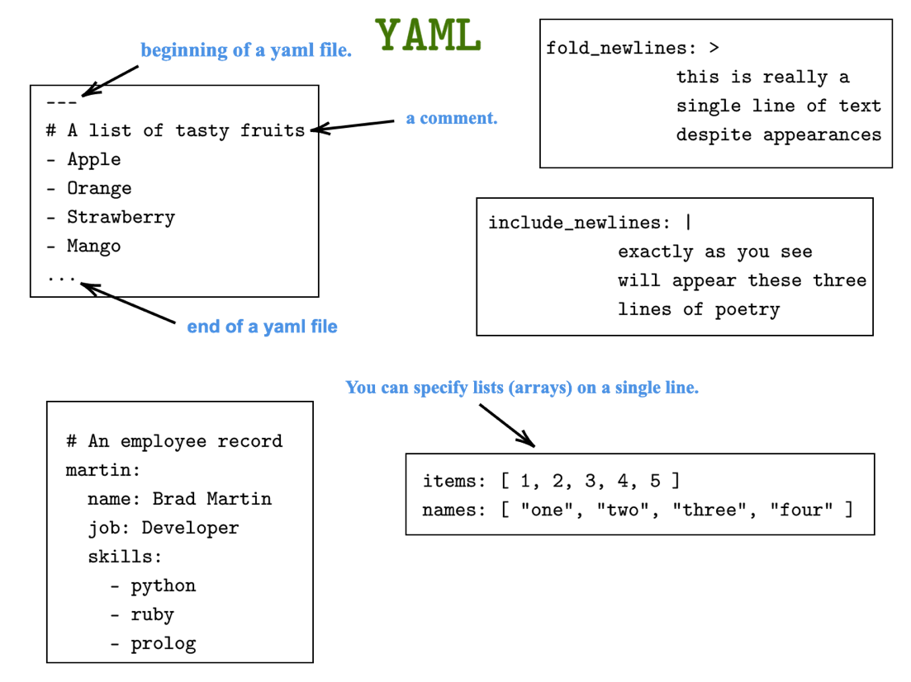

<a href="https://github.com/nirgeier/AnsibleLabs/actions/workflows/Lab-004.yaml" target="_blank">
  
</a>

---


# Lab 004 - Playbooks

<br/>
<div style="display: flex; align-items: flex-start;">
  
  <div>
    <ul>
      <li>In this section, we will cover the <strong>Ansible Playbooks</strong>.</li>
      <li><strong>Playbooks</strong> are essentially "Ansible scripts" serving as one of <code>Ansible's</code> building blocks.</li>
    </ul>
  </div>
</div>

---

### Pre-Requirements

- Complete the [lab 002](../002-no-inventory#usage) in order to have `Ansible` set up.

---

## 01. What are playbooks?

- In the previous labs, we have executed an `Ansible ad-hoc command` which invoked modules.
- In real life we need more than just `modules`...
- This is where `Ansible playbook` jumps in for the rescue.
- `Ansible playbooks` are essentially **blueprints of automation tasks**. 
- They are written in `YAML` format, and are used to **automate tasks on remote hosts**. 
- In summary, `Ansible playbooks` offer a repeatable, reusable and simple configuration management & multi-machine deployment system, well suited to deploying complex applications. 
- `Ansible playbooks` are a **powerful** tool for automating infrastructure management.

---

## 02. Key points

- **Structure** - A playbook is composed of one or more `plays`, in an **ordered list** (Sequence). 
  Each play executes **part** of the overall goal of the playbook, running one or more tasks, whereas each task calls an `Ansible module`.


- **Execution** - A playbook runs in sequential order, from top to bottom. Within each play, tasks also run in a sequential order, from top to bottom. Playbooks containing multiple `plays` can orchestrate **multi-machine deployments**.

- **Functionality** - Playbooks can declare **configurations** and **orchestrate steps** of any manual ordered process, on **multiple** sets of machines, in a pre-defined order, while launching tasks, either synchronously or asynchronously.

- **Use Cases** - Playbooks are regularly used to automate IT infrastructure, networks, security systems and code repositories (like GitHub). IT staff can also use playbooks to program applications, services, server nodes and other devices.

- **Reusability** - The conditions, variables and tasks within playbooks can be saved, shared or reused indefinitely. This makes it easier for IT teams to codify operational knowledge and ensure that the same actions are performed consistently across different environments.

---

## 03. Playbook basics

#### YAML

- The `playbook` is usually written in [YAML](https://ja.wikipedia.org/wiki/YAML) format.
- Nevertheless, `playbooks` can be written in [JSON](https://en.wikipedia.org/wiki/JSON) format as well.
- In this lab we will be using only YAML format for `playbooks`.
- YAML is a text file that uses "Python-style" indentation to indicate nesting, which **does not require quotes** around most string values.
- Files should start with `---`.
- As **indentations have meanings**, they are extremely important!!!
- Indentation should be written using `space`, as using `tab` will result in an error.
- The level of indentation (using spaces, not tabs) is used to **denote structure**.
- Building the playbook using **Key-Value Pairs**, making them as dictionary in YAML that is represented in a simple `key`: `value` form.
- The `:` (colon) **must** be followed by a space.
- All members of a `list` are lines beginning at the **same indentation level** starting with a `-` (a dash and a space).
- As values can span multiple lines, using `|` or `>`, `playbooks` support **Multi-Line Strings**. 
- Using a `Literal Block Scalar`  [`|`] will include the newlines and any trailing spaces. 
- Using a `Folded Block Scalar`   [`>`] will fold new lines into spaces.
- **Boolean Values** (true/false) can be specified in several forms. For example, use a lowercase `true` or `false` boolean value in dictionaries in order to be compatible with default yamllint options.
- YAML is **case sensitive**, so be careful with your capitalization.



---

## 04. Our first playbook

- Here is our first playbook example that will list files in a given directory.

  ```yaml
  ---
  # Run on all the hosts
  - hosts: all
    
    # Here we define our tasks
    tasks:  
      # This is the first task 
      - name: List files in a directory  
        # As learned before this is the command module
        # This command will list files in the home directory
        command: ls ~  

        # register is used whenever we wish to save the output 
        # In this case it will be saved to a variable named 'files'
        register: files  

      # This is the second task
      # In this case the tasks will run in the declared sequence 
      - name: Print the list of files  
        # Using the builtin debug module 
        # The debug will print out our files list
        # ** We need to use `stdout_lines` for that
        debug:  
          msg: "{{ files.stdout_lines }}"  
  
  ```


#### Writing a playbook

- Let's open the editor and write the first playbook in `YAML` format.

#### Playbook content:

- `YAML` should start with the `---`
- Define the hosts we wish to run on. In this sample we will use our `localhost`.  
- Define the playbook tasks.

##### **It's as simple as that!**

---

#### Hands-on 

- Use the following code skeleton for our first playbook:
  ```YAML
  # List of hosts
  - hosts: 
    
    # List of tasks
    tasks:
      - name: Execute 'uname -a'
        
      - name: Print 'uname -a' output
        
      - name: Execute 'id'
        
      - name: Print 'id' output
  ```

- Now let's fill it in with content.
- First lets define localhost as the host for this playbook:
  ```YAML
  ---
  - hosts: localhost
  ```
- Next steps is to define the tasks:

!!! warning "TIP"
    Like in every other programming / scripting language, there is no one "right" or "wrong"
    solution. The bellow solution will work like any other solution that will work
    for you, so feel free to write it any way which works best for you.

```YAML
  # List of hosts
  - hosts: localhost
    
    ###
    ### In this sample we display several solutions
    ### 
    ### We combine few commands like: `shell`, `debug`, `command` and more
    ###
    
    # List of tasks
    tasks:
      # Using shell it will work, but no out put will be displayed out
      # We will need to use register to display output
      - name: Execute 'uname -a'
        shell: uname -a
        register: task_output
      
      # Using register we can now display the output contents
      # We must use `.stdout` to display the output itself
      - name: Print 'uname -a' output
        debug: 
          msg: "{{ task_output.stdout}}"    

### Output:

  * Executing Ansible ad-hoc commands

  $ ansible localhost -m shell -a 'uname -a'
  localhost | CHANGED | rc=0 >>
  Linux 1fa29998d58c 5.15.0-105-generic #115-Ubuntu SMP Mon Apr 15 09:52:04 
  UTC 2024 aarch64 aarch64 aarch64 GNU/Linux
  -----------------------------------

  * Executing ansible playbook

  $ cat 004-playbook.yaml
    # List of hosts
    - hosts: localhost

      ###
      ### In this sample we display several solutions
      ###
      ### We combine few commands like: `shell`, `debug`, `command` and more
      ###

      # List of tasks
      tasks:
        # Using shell it will work, but no out put will be displayed out
        # We will need to use register to display output
        - name: Execute 'uname -a'
          shell: uname -a
          register: task_output

        # Using register we can now display the output contents
        # We must use `.stdout` to display the output itself
        - name: Print 'uname -a' output
          debug:
            msg: "{{ task_output.stdout}}"   
```

---


  <br/>

  - Complete the playbook, this time use `command` instead of shell:

```sh
  $ ansible-playbook 004-install-nginx.yaml
  
  PLAY [localhost] ***************************************************************

  TASK [Gathering Facts] *********************************************************
  ok: [localhost]

  TASK [Execute 'uname -a'] ******************************************************
  changed: [localhost]

  TASK [Display the output] ******************************************************
  ok: [localhost] => {
      "msg": "Linux 1fa29998d58c 5.15.0-105-generic #115-Ubuntu SMP Mon Apr 15
      09:52:04 UTC 2024 aarch64 aarch64 aarch64 GNU/Linux"
  }

  PLAY RECAP *********************************************************************
  localhost                  : ok=3    changed=1    unreachable=0    failed=0    skipped=0    rescued=0    ignored=0
```


---


## 05. Playbook syntax

- In this section, we will learn further about playbook's syntax.

#### `Play`
- [See official documentation](https://docs.ansible.com/ansible/latest/reference_appendices/playbooks_keywords.html#play).
- The **top** part of the playbook is called `Play` and it **defines** the **global behavior** of for the **entire** playbook.
- Here are some definitions which are set in the `Play` section:

  ```yaml
  ---
  - name: The name of the play
    # A list of groups, hosts or host pattern that translates into a list 
    # of hosts that are the play’s target.
    hosts: localhost
    
    # Boolean that controls if privilege escalation is used or not on 
    # Task execution.
    # Implemented by the become plugin
    become: yes

    # User that you ‘become’ after using privilege escalation. 
    # The remote/login user must have permissions to become this user.
    become_user: 

    # A dictionary that gets converted into environment vars to be provided 
    # for the task upon execution. 
    # This can ONLY be used with modules. 
    # This is not supported for any other type of plugins nor Ansible itself 
    # nor its configuration, it just sets the variables for the code responsible
    # for executing the task. 
    # This is not a recommended way to pass in confidential data.
    environment: 
    
    # Dictionary/map of variables
    vars: 
  ```

---

## 06. Quiz

  - Review the example below and try to answer the following questions:
    - On which hosts the playbook should be executed?
    - How do we define the play?
    - Which directives are defined in the below playbook?
    - How do we define variables?
    - How do we use variables?
    - How do we set up a root user?
      
      ```yaml
      #
      # Install nginx
      #
      name: Install and start nginx
      
      # We should have this group in our inventory
      hosts: webservers
      
      # Variables
      # The `lookup` function is used to fetch the value of the environment variables 
      vars:
        env:
          PORT: "{{ lookup('env','PORT') }}"
          PASSWORD: "{{ lookup('env','PASSWORD') }}"

      # Define the tasks    
      tasks:
        - name: Install nginx
          apt:
            name: nginx
            state: present
          become: yes

        - name: Start nginx service
          service:
            name: nginx
            state: started
          become: yes

        - name: Create a new secret with environment variable
          shell: echo "secret:{{ PASSWORD }}" > /etc/secret
          become: yes

        - name: Open the port in firewall
          ufw:
            rule: allow
            port: "{{ PORT }}"
            proto: tcp
          become: yes
      ```

---

## 07. Playbook demo

- Execute the playbook by adding the required parameters.
- This can be done by setting up the parameters prior to executing the playbook, or by adding the parameters to the playbook itself.

#### Setting the env variable in the Ansible controller
  
  ```yaml
  # Example: 

  # 01. Setting the env variable in the Ansible controller
  export PORT=8080
  
  # Use the -e/--extra-vars to inject environment variables into the playbook
  ansible-playbook playbook.yaml -e "my_var=$MY_VAR"

  # Using the lookup Plug to fetch the value of the environment variables
  PORT: "{{ lookup('env','PORT') }}"
  ```

#### Passing the variable to the playbook
  
  ```yaml
  # Example:

  # 02. Passing the variable to the playbook
  PORT="8080" ansible-playbook playbook.yaml
  ```

#### Using the environment
  
  
  ```yaml
  # Example:

  # 0.3 Using the environment keyword in a **task** to set variables for that task
  - name: Open the port in firewall
    environment:
      PORT: "8080"
    ufw:
      rule: allow
      port: "{{ PORT }}"
      proto: tcp
  ```

#### Passing the environment
  
  ```yaml
  # Example:

  # 0.4 Passing the environment to all the tasks in Playbook
  - hosts: all
    environment:
      PORT: "8080"
    tasks:
      - name: Open the port in firewall
      ...
  ```

#### Set environment
  ```yaml
  # Example:

  # 05. Permanently set environment variables on remote hosts to persist variables 
  #     (e.g., in .bashrc or /etc/environment)
  - name: Set permanent environment variable
    lineinfile:
      path: /etc/environment
      line: 'PORT="8080"'
      state: present
    become: yes
  ```

#### Using `var_files` to include variables

  
  ```yaml
    # Example

    # 06. We can use a variable file to pass variables in a playbook
    # Check the vars.yaml file in the same directory
    - hosts: all
      vars_files:
        - vars.yaml  # Include variables from vars.yaml
      tasks:
        - name: Print a variable
          debug:
            msg: "{{ http_port }}"
  ```

---

## 08. Tasks

  - See documentation on [running playbooks in check mode](https://docs.ansible.com/ansible/latest/playbook_guide/playbooks_intro.html#running-playbooks-in-check-mode).
  
    ```sh
    # To run a playbook in check mode, 
    # you can pass the -C or --check flag to 
    # the ansible-playbook command:

    ansible-playbook --check playbook.yaml
    ```

- Let's write some playbook tasks with parameters.
- Take a look on `004-list-files.yaml` and follow the instructions in the comments.
- Answer the questions in the comments about the `with_items` output of the playbook.

## 09. Additional tasks

- Run the playbook and watch the output.
- Run the playbook in `check mode` and watch the output.
- Run the playbook with `--diff` flag and watch the output.
- Run the playbook with `--verbose` flag and watch the output.
- Run the playbook with `--verbose` and `--diff` flags and watch the output.
- Run the playbook with `--verbose`, `--diff` and `--check` flags and watch the output.
 
---

!!! warning "TIP"
    It's considered best practice to use the FQDN name of all modules used in your playbook.
    It is done to prevent naming collision between builtin modules and community modules or self made ones.