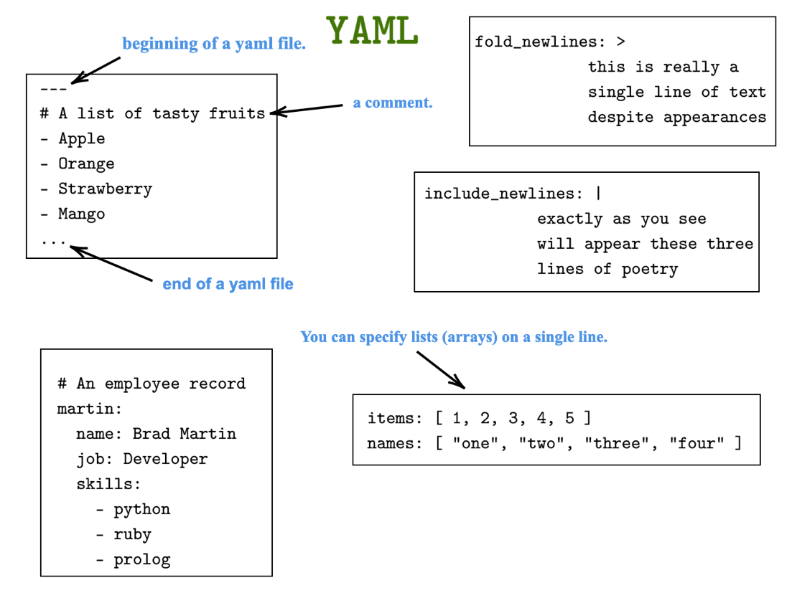

---

# Playbooks

* <br/> <div style="display: flex; align-items: flex-start;">  <div> <ul> <li>In this section, we will cover the <strong>Ansible Playbooks</strong>.</li> <li><strong>Playbooks</strong> are essentially "Ansible scripts" serving as one of <code>Ansible's</code> building blocks.</li> </ul> </div> </div>

## What will we learn?

- What Ansible playbooks are and why they are used
- How to write and structure a playbook in YAML
- How to run playbooks using `ansible-playbook`
- The difference between ad-hoc commands and playbooks
- How to use variables, tasks, and plays in playbooks

---

## Prerequisites

- Complete the [lab 002](../002-no-inventory/README.md#usage) in order to have `Ansible` set up.

---

## 01. What are playbooks?

- In the previous labs, we have executed an `Ansible ad-hoc command` which invoked modules.
- While ad-hoc commands are useful for quick tasks, real-world scenarios require more complex orchestration.
- This is where `Ansible playbooks` come to the rescue.
- `Ansible playbooks` are essentially **blueprints of automation tasks** written in `YAML` format.
- They are used to **automate tasks on remote hosts** in a structured, repeatable manner.

#### Ad-hoc Commands vs Playbooks

| Aspect              | Ad-hoc Commands      | Playbooks                      |
| ------------------- | -------------------- | ------------------------------ |
| **Use Case**        | Quick one-time tasks | Complex multi-step workflows   |
| **Repeatability**   | Limited              | Fully repeatable               |
| **Version Control** | Difficult            | Easy (YAML files)              |
| **Documentation**   | Poor                 | Self-documenting               |
| **Orchestration**   | Single task          | Multiple tasks, multiple hosts |
| **Conditionals**    | Not supported        | Full support                   |
| **Error Handling**  | Basic                | Advanced                       |

#### Why Use Playbooks?

- **Repeatability**: Run the same tasks consistently across environments
- **Reusability**: Share playbooks across teams and projects
- **Orchestration**: Coordinate complex multi-machine deployments
- **Version Control**: Track changes to your automation
- **Documentation**: YAML format is self-documenting
- **Idempotency**: Safe to run multiple times
- **Error Handling**: Built-in error handling and rollback capabilities

---

## 02. Key points

<div class="grid cards" markdown>

- :material-format-list-bulleted: \***\*Structure\*\***

  ***
  - A playbook is composed of one or more `plays`, in an **ordered list** (Sequence).
  - Each play executes **part** of the overall goal of the playbook, running one or more tasks, whereas each task calls an `Ansible module`.

- :material-flash: \***\*Execution\*\***

  ***
  - `Playbooks` runs in sequential order, from top to bottom.
  - Within each `play`, tasks also run in a sequential order, from top to bottom.
  - `Playbooks` containing multiple `plays` can orchestrate **multi-machine deployments**.

- :material-cog: \***\*Functionality\*\***

  ***
  - `Playbooks` can declare **configurations** and **orchestrate steps** of any manual ordered process, on **multiple** sets of machines, in a pre-defined order, while launching tasks, either synchronously or asynchronously.

- :material-bullseye-arrow: \***\*Use Cases\*\***

  ***
  - `Playbooks` are regularly used to automate IT infrastructure, networks, security systems and code repositories (like GitHub).
  - IT staff can also use playbooks to program applications, services, server nodes and other devices.

- :material-recycle: \***\*Reusability\*\***

  ***
  - The `conditions`, `variables` and `tasks` within playbooks can be saved, shared or reused indefinitely.
  - This makes it easier for IT teams to codify operational knowledge and ensure that the same actions are performed consistently across different environments.

</div>

---

## 03. YAML basics

#### Understanding YAML

- The `playbook` is usually written in [YAML](https://ja.wikipedia.org/wiki/YAML) format.
- Nevertheless, `playbooks` can be written in [JSON](https://en.wikipedia.org/wiki/JSON) format as well.
- In this lab we will be using only YAML format for `playbooks`.
- YAML is a text file that uses "Python-style" indentation to indicate nesting, which **does not require quotes** around most string values.
- Files should start with `---`.
- As **indentations have meanings**, they are extremely important!!!
- Indentation should be written using `space`, as using `tab` will result in an error.
- The level of indentation (using spaces, not tabs) is used to **denote structure**.
- Building the playbook using **Key-Value Pairs**, making them as dictionary in YAML that is represented in a simple `key`: `value` form.
- The `:` (colon) **must** be followed by a space.
- All members of a `list` are lines beginning at the **same indentation level** starting with a `-` (a dash and a space).
- As values can span multiple lines, using `|` or `>`, `playbooks` support **Multi-Line Strings**.
- Using a `Literal Block Scalar` [`|`] will include the newlines and any trailing spaces.
- Using a `Folded Block Scalar` [`>`] will fold new lines into spaces.
- **Boolean Values** (true/false) can be specified in several forms. For example, use a lowercase `true` or `false` boolean value in dictionaries in order to be compatible with default yamllint options.
- YAML is **case sensitive**, so be careful with your capitalization.

      

---

## 05. Our first playbook

#### Simple Example

- Here is our first playbook example that will list files in a given directory.

  ```yaml
  ---
  # Run on all the hosts
  - hosts: all

    # Here we define our tasks
    tasks:
      # This is the first task
      - name: List files in a directory
        # As learned before this is the command module
        # This command will list files in the home directory
        command: ls ~

        # register is used whenever we wish to save the output
        # In this case it will be saved to a variable named 'files'
        register: files

      # This is the second task
      # In this case the tasks will run in the declared sequence
      - name: Print the list of files
        # Using the builtin debug module
        # The debug will print out our files list
        # ** We need to use `stdout_lines` for that
        debug:
          msg: "{{ files.stdout_lines }}"
  ```

#### Writing Your First Playbook

**Step 1**: Start with the document marker

```yaml
---
```

**Step 2**: Define the play with target hosts

```yaml
---
- name: My first playbook
  hosts: localhost
```

**Step 3**: Add tasks

```yaml
---
- name: My first playbook
  hosts: localhost
  tasks:
    - name: Print a message
      debug:
        msg: "Hello, Ansible!"
```

**Step 4**: Run the playbook

```sh
ansible-playbook my-first-playbook.yaml
```

##### **It's as simple as that!**

---

## 06. Playbook execution

#### Running a Playbook

```sh
# Basic execution
ansible-playbook playbook.yaml

# With inventory file
ansible-playbook -i inventory playbook.yaml

# Limit to specific hosts
ansible-playbook playbook.yaml --limit webservers

# Check mode (dry run)
ansible-playbook playbook.yaml --check

# Show differences
ansible-playbook playbook.yaml --diff

# Verbose output
ansible-playbook playbook.yaml -v
ansible-playbook playbook.yaml -vv   # More verbose
ansible-playbook playbook.yaml -vvv  # Very verbose
```

#### Understanding Playbook Output

```sh
PLAY [webservers] *********************************************************

TASK [Gathering Facts] *****************************************************
ok: [web1]
ok: [web2]

TASK [Install nginx] ******************************************************
changed: [web1]
changed: [web2]

PLAY RECAP ****************************************************************
web1     : ok=2    changed=1    unreachable=0    failed=0    skipped=0
web2     : ok=2    changed=1    unreachable=0    failed=0    skipped=0
```

**Task Status:**

- **ok**: Task executed successfully, no changes made
- **changed**: Task executed and made changes
- **failed**: Task failed
- **skipped**: Task was skipped due to conditions
- **unreachable**: Host was unreachable

---

## 05. Playbook syntax

- In this section, we will learn further about playbook's syntax.

#### `Play`

- [See official documentation](https://docs.ansible.com/ansible/latest/reference_appendices/playbooks_keywords.html#play).
- The **top** part of the playbook is called `Play` and it **defines** the **global behavior** of for the **entire** playbook.
- Here are some definitions which are set in the `Play` section:

  ```yaml
  ---
  - name: The name of the play
    # A list of groups, hosts or host pattern that translates into a list
    # of hosts that are the play’s target.
    hosts: localhost

    # Boolean that controls if privilege escalation is used or not on
    # Task execution.
    # Implemented by the become plugin
    become: yes

    # User that you ‘become’ after using privilege escalation.
    # The remote/login user must have permissions to become this user.
    become_user:

    # A dictionary that gets converted into environment vars to be provided
    # for the task upon execution.
    # This can ONLY be used with modules.
    # This is not supported for any other type of plugins nor Ansible itself
    # nor its configuration, it just sets the variables for the code responsible
    # for executing the task.
    # This is not a recommended way to pass in confidential data.
    environment:

    # Dictionary/map of variables
    vars:
  ```

---

## 08. Variables in playbooks

#### Defining Variables

```yaml
---
- name: Variable examples
  hosts: all
  vars:
    # Simple variables
    http_port: 80
    app_name: myapp

    # List variables
    packages:
      - nginx
      - git
      - curl

    # Dictionary variables
    database:
      host: db.example.com
      port: 5432
      name: mydb

  tasks:
    - name: Use variables
      debug:
        msg: "App {{ app_name }} runs on port {{ http_port }}"

    - name: Access dictionary
      debug:
        msg: "Database: {{ database.host }}:{{ database.port }}"
```

#### Variable Sources

1. **Playbook vars**: Defined in playbook
2. **vars_files**: External YAML files
3. **Command line**: `-e "var=value"`
4. **Inventory**: Host/group variables
5. **Facts**: Gathered from systems
6. **Environment**: `lookup('env', 'VAR')`

#### Variable Precedence (lowest to highest)

Understanding variable precedence helps you control which values take priority when the same variable is defined in multiple places.

**Quick Reference:**

1.  Role defaults
2.  Inventory file/script variables
3.  Playbook vars
4.  vars_files
5.  Host facts
6.  Registered variables
7.  Set_facts
8.  Play vars_prompt
9.  Play vars
10. Extra vars (`-e`)

**Detailed Examples:**

1. **Role defaults** (lowest priority)

   ```yaml
   # roles/myapp/defaults/main.yml
   app_port: 8080
   app_env: development
   ```

2. **Inventory file/script variables**

   ```ini
   # inventory
   [webservers]
   web1 ansible_host=192.168.1.10 app_port=8081

   [webservers:vars]
   app_env=staging
   ```

3. **Playbook vars**

   ```yaml
   ---
   - hosts: webservers
     vars:
       app_port: 8082
       app_env: production
   ```

4. **vars_files**

   ```yaml
   # vars/production.yml
   app_port: 8083
   app_env: production

   # playbook
   - hosts: webservers
     vars_files:
       - vars/production.yml
   ```

5. **Host facts** (discovered automatically)

   ```yaml
   tasks:
     - name: Use discovered facts
       debug:
         msg: "OS: {{ ansible_distribution }}"
   ```

6. **Registered variables**

   ```yaml
   tasks:
     - name: Get timestamp
       command: date +%s
       register: current_time

     - name: Use registered var
       debug:
         msg: "Time: {{ current_time.stdout }}"
   ```

7. **Set_facts**

   ```yaml
   tasks:
     - name: Set custom fact
       set_fact:
         app_port: 8084
         calculated_value: "{{ ansible_hostname }}_app"
   ```

8. **Play vars_prompt**

   ```yaml
   ---
   - hosts: webservers
     vars_prompt:
       - name: app_port
         prompt: "Enter the application port"
         private: no
   ```

9. **Play vars**

   ```yaml
   ---
   - hosts: webservers
     vars:
       app_port: 8085 # Higher priority than playbook-level vars
   ```

10. **Extra vars (`-e`)** (highest priority)
    ```sh
    ansible-playbook playbook.yaml -e "app_port=9000"
    ansible-playbook playbook.yaml -e "@vars/override.yml"
    ```

#### Precedence Example

If you define `app_port` in multiple places, the highest precedence wins:

```yaml
# roles/myapp/defaults/main.yml
app_port: 8080  # Priority 1 (lowest)

# inventory
[webservers:vars]
app_port=8081   # Priority 2

# playbook.yml
- hosts: webservers
  vars:
    app_port: 8082  # Priority 3
  vars_files:
    - vars.yml      # Priority 4 (vars.yml contains app_port: 8083)

  tasks:
    - set_fact:
        app_port: 8084  # Priority 7

    - debug:
        msg: "Port: {{ app_port }}"  # Will use 8084 unless overridden

# Command line (highest)
$ ansible-playbook playbook.yaml -e "app_port=9000"
# Output: Port: 9000
```

---

## 09. Handlers and notifications

#### What are Handlers?

- Special tasks that run only when notified by other tasks
- Typically used to restart services after configuration changes
- Run once at the end of a play, even if notified multiple times
- Execute in the order they are defined, not the order they are notified
- Only run if a task that notifies them reports a "changed" status

#### Key Characteristics

| Aspect          | Description                                    |
| --------------- | ---------------------------------------------- |
| **Execution**   | Run at the end of the play                     |
| **Trigger**     | Only when notified and task changed            |
| **Frequency**   | Once per play, even if notified multiple times |
| **Order**       | Defined order, not notification order          |
| **Idempotency** | Help maintain idempotent playbooks             |

#### Basic Handler Example

**Purpose**:

- Demonstrates the fundamental concept of handlers in Ansible
- Shows how multiple tasks can notify the same handler
- Handler executes only once at the end of the play, even when notified multiple times
- Essential for efficient service management - avoids restarting a service multiple times
- Ideal when several configuration changes occur in sequence

```yaml
---
- name: Configure web server
  hosts: webservers
  become: yes

  tasks:
    - name: Install nginx
      apt:
        name: nginx
        state: present
      notify: restart nginx

    - name: Copy nginx config
      copy:
        src: nginx.conf
        dest: /etc/nginx/nginx.conf
      notify: restart nginx

  handlers:
    - name: restart nginx
      service:
        name: nginx
        state: restarted
```

**How it works:**

1. If either task changes something, it notifies the handler
2. Handler runs once at the end, even though notified twice
3. If neither task changes anything, handler doesn't run

---

#### Multiple Handlers in Sequence

**Purpose**:

- Illustrates triggering multiple handlers from a single task using a list of handler names
- Allows you to notify all handlers at once when performing several related actions
- Handlers execute in the order they are defined in the handlers section
- Execution order is NOT based on the order in the notify list
- Useful for orchestrating complex post-change workflows (restart → clear cache → notify)

```yaml
---
- name: Update application
  hosts: appservers
  become: yes

  tasks:
    - name: Update application code
      copy:
        src: app.py
        dest: /opt/app/app.py
      notify:
        - restart app
        - clear cache
        - send notification

  handlers:
    - name: restart app
      service:
        name: myapp
        state: restarted

    - name: clear cache
      command: rm -rf /var/cache/myapp/*

    - name: send notification
      debug:
        msg: "Application updated and restarted"
```

---

#### Handler with Conditionals

**Purpose**:

- Shows how to apply conditional logic to handlers using the `when` statement
- Not all handlers need to run in every scenario
- Certain handlers execute only when specific conditions are met
- Example: SSL-specific restart handler only runs when SSL is enabled
- Allows flexible playbooks that adapt to different environments without duplication

```yaml
---
- name: Conditional handler example
  hosts: webservers
  become: yes
  vars:
    enable_ssl: true

  tasks:
    - name: Copy nginx config
      template:
        src: nginx.conf.j2
        dest: /etc/nginx/nginx.conf
      notify:
        - reload nginx
        - restart nginx ssl

  handlers:
    - name: reload nginx
      service:
        name: nginx
        state: reloaded

    - name: restart nginx ssl
      service:
        name: nginx
        state: restarted
      when: enable_ssl
```

---

#### Listening to Handlers

**Purpose**:

- The `listen` directive groups related handlers under a common topic or event name
- Notify a single event name instead of notifying each handler individually
- All handlers listening to that event will execute automatically
- Particularly useful when multiple post-change actions always need to happen together
- Decouples tasks from specific handler names for better maintainability
- You can add or remove handlers without modifying the tasks that notify them

```yaml
---
- name: Handler listening example
  hosts: all
  become: yes

  tasks:
    - name: Update system configuration
      copy:
        content: "config changes"
        dest: /etc/myapp.conf
      notify: system updated

  handlers:
    - name: Restart application
      service:
        name: myapp
        state: restarted
      listen: system updated

    - name: Clear application cache
      command: /usr/local/bin/clear_cache.sh
      listen: system updated

    - name: Log the update
      shell: echo "System updated at $(date)" >> /var/log/updates.log
      listen: system updated
```

**Benefit**: All three handlers execute when any task notifies "system updated"

---

#### Forcing Handler Execution

**Purpose**:

- By default, handlers run at the end of a play
- Sometimes you need a handler to execute immediately before continuing
- `meta: flush_handlers` forces all notified handlers to run at that specific point
- Critical when later tasks depend on the handler's actions
- Example scenarios: restart service before health check, apply config before tests
- Without this, verification tasks might run before the service has restarted

```yaml
---
- name: Force handler execution
  hosts: webservers
  become: yes

  tasks:
    - name: Update config file
      copy:
        src: app.conf
        dest: /etc/app.conf
      notify: restart app

    - name: Force handlers to run now
      meta: flush_handlers

    - name: Verify app is running
      uri:
        url: http://localhost:8080/health
        status_code: 200
```

**Use case**: When you need to ensure a service is restarted before continuing

---

#### Handlers in Roles

**Purpose**:

- Demonstrates organizing handlers within Ansible roles (recommended approach)
- Handlers are defined in the `handlers/main.yml` file, separate from tasks
- Separation of concerns makes roles cleaner and more maintainable
- Tasks within the role notify handlers just like in regular playbooks
- Handlers are scoped to that role for proper encapsulation
- Create self-contained roles that can be shared across projects
- No worries about handler name conflicts between roles

```yaml
# roles/nginx/tasks/main.yml
---
- name: Install nginx
  apt:
    name: nginx
    state: present

- name: Copy nginx config
  template:
    src: nginx.conf.j2
    dest: /etc/nginx/nginx.conf
  notify: restart nginx

# roles/nginx/handlers/main.yml
---
- name: restart nginx
  service:
    name: nginx
    state: restarted

- name: reload nginx
  service:
    name: nginx
    state: reloaded

- name: check nginx config
  command: nginx -t
  listen: validate nginx
```

---

#### Handler Best Practices

**✅ Do:**

- Use descriptive handler names
- Keep handlers idempotent
- Use `listen` for grouping related handlers
- Place handlers after tasks in playbook
- Use `meta: flush_handlers` when order matters

**❌ Don't:**

- Don't use handlers for critical tasks that must run
- Don't rely on handler execution order across different notifications
- Don't use handlers for tasks that should run regardless of changes
- Don't create handler dependencies (they run independently)

---

#### Common Handler Patterns

**Pattern 1: Service Management**

**Purpose**:

- Shows the most common handler use case - managing service states
- Having both `restart` and `reload` handlers provides flexibility
- Use `restart` for full service restart (after installing packages or major config changes)
- Use `reload` for configuration reloads without interrupting active connections
- Most production services support reload operations for graceful configuration updates
- Minimizes downtime by choosing the appropriate service state change

```yaml
handlers:
  - name: restart nginx
    service:
      name: nginx
      state: restarted

  - name: reload nginx
    service:
      name: nginx
      state: reloaded
```

**Pattern 2: Configuration Validation**

**Purpose**:

- Demonstrates critical safety practice - validate configuration before applying changes
- Using a `block` in the handler allows testing configuration file syntax first
- Only proceeds with restart if validation passes
- Prevents breaking a running service with invalid configuration
- If validation fails, service continues running with old (working) configuration
- Essential for production environments where service uptime is critical

```yaml
handlers:
  - name: validate and restart nginx
    block:
      - name: Test nginx config
        command: nginx -t

      - name: Restart nginx
        service:
          name: nginx
          state: restarted
```

**Pattern 3: Cascade Handlers**

**Purpose**:

- Advanced pattern showing handlers that notify other handlers (chain of actions)
- First handler executes, then notifies the next handler in the chain
- Useful for complex deployment scenarios requiring specific sequences
- Example flow: deploy code → restart → verify health → update load balancer → notify monitoring
- Use carefully as it can make execution flow harder to understand
- Ensure each handler can work independently and handle failures gracefully

```yaml
tasks:
  - name: Update app code
    copy:
      src: app.py
      dest: /opt/app/
    notify: restart app

handlers:
  - name: restart app
    service:
      name: myapp
      state: restarted
    notify: verify app

  - name: verify app
    uri:
      url: http://localhost:8080/health
```

---

#### Real-World Example: Database Configuration

**Purpose**:

- Comprehensive example bringing together multiple handler concepts in production scenario
- Demonstrates configuration validation before applying changes
- Uses different handlers for different change types (restart vs reload)
- Verifies service health after changes with automatic retries
- Orchestrates multiple handlers in response to configuration updates
- Production-ready pattern for safely managing critical database services
- Minimizes downtime by catching configuration errors before affecting running service
- `pg_hba.conf` changes trigger reload only (less disruptive)
- Main configuration changes trigger full restart after validation

```yaml
---
- name: Configure PostgreSQL
  hosts: databases
  become: yes

  tasks:
    - name: Install PostgreSQL
      apt:
        name: postgresql
        state: present

    - name: Configure PostgreSQL
      template:
        src: postgresql.conf.j2
        dest: /etc/postgresql/14/main/postgresql.conf
      notify:
        - validate postgresql config
        - restart postgresql
        - verify postgresql

    - name: Configure pg_hba
      template:
        src: pg_hba.conf.j2
        dest: /etc/postgresql/14/main/pg_hba.conf
      notify: reload postgresql

  handlers:
    - name: validate postgresql config
      command: /usr/lib/postgresql/14/bin/postgres -C config_file -D /var/lib/postgresql/14/main
      changed_when: false

    - name: restart postgresql
      service:
        name: postgresql
        state: restarted

    - name: reload postgresql
      service:
        name: postgresql
        state: reloaded

    - name: verify postgresql
      postgresql_ping:
        db: postgres
      retries: 3
      delay: 5
```

---

## 10. Understanding the register keyword

#### Capturing Task Output

```yaml
---
- name: Register examples
  hosts: localhost
  tasks:
    - name: Check if file exists
      stat:
        path: /etc/nginx/nginx.conf
      register: nginx_config

    - name: Display result
      debug:
        msg: "File exists: {{ nginx_config.stat.exists }}"

    - name: Run command
      shell: uname -r
      register: kernel_version

    - name: Show kernel version
      debug:
        var: kernel_version.stdout
```

#### Using Registered Variables

```yaml
tasks:
  - name: Get service status
    command: systemctl status nginx
    register: service_status
    failed_when: false
    changed_when: false

  - name: Restart if not running
    service:
      name: nginx
      state: restarted
    when: service_status.rc != 0
```

---

## 11. Conditionals

#### When Statements

```yaml
---
- name: Conditional examples
  hosts: all
  tasks:
    - name: Install nginx on Debian
      apt:
        name: nginx
        state: present
      when: ansible_os_family == "Debian"

    - name: Install nginx on RedHat
      yum:
        name: nginx
        state: present
      when: ansible_os_family == "RedHat"

    - name: Multiple conditions (AND)
      debug:
        msg: "This is a production Ubuntu server"
      when:
        - ansible_distribution == "Ubuntu"
        - env == "production"

    - name: Multiple conditions (OR)
      debug:
        msg: "This is either staging or development"
      when: env == "staging" or env == "development"
```

---

## 12. Loops

#### Using loop

```yaml
---
- name: Loop examples
  hosts: all
  tasks:
    - name: Install multiple packages
      apt:
        name: "{{ item }}"
        state: present
      loop:
        - nginx
        - git
        - curl
        - vim

    - name: Create multiple users
      user:
        name: "{{ item.name }}"
        state: present
        groups: "{{ item.groups }}"
      loop:
        - { name: "alice", groups: "admin,developers" }
        - { name: "bob", groups: "developers" }
        - { name: "charlie", groups: "users" }
```

#### Loop with dict

```yaml
tasks:
  - name: Set file permissions
    file:
      path: "{{ item.key }}"
      mode: "{{ item.value }}"
      state: touch
    loop: "{{ lookup('dict', file_permissions) }}"
    vars:
      file_permissions:
        /tmp/file1.txt: "0644"
        /tmp/file2.txt: "0600"
        /tmp/file3.txt: "0755"
```

---

## 13. Tags

#### Using Tags

```yaml
---
- name: Complete server setup
  hosts: all
  tasks:
    - name: Install packages
      apt:
        name: nginx
        state: present
      tags:
        - install
        - packages

    - name: Configure nginx
      copy:
        src: nginx.conf
        dest: /etc/nginx/nginx.conf
      tags:
        - config
        - nginx

    - name: Start nginx
      service:
        name: nginx
        state: started
      tags:
        - service
        - nginx
```

#### Running with Tags

```sh
# Run only tasks with 'install' tag
ansible-playbook playbook.yaml --tags install

# Run multiple tags
ansible-playbook playbook.yaml --tags "install,config"

# Skip tasks with specific tags
ansible-playbook playbook.yaml --skip-tags service

# List all tags
ansible-playbook playbook.yaml --list-tags
```

---

## 14. Playbook best practices

#### Naming Conventions

- Use descriptive play and task names
- Use consistent naming patterns
- Include verbs in task names

```yaml
# ❌ Bad
- name: nginx
  apt:
    name: nginx

# ✅ Good
- name: Install nginx web server
  apt:
    name: nginx
    state: present
```

#### Organization

- Keep playbooks focused and modular
- Use roles for reusable content
- Separate variables into files
- Use inventory groups effectively

#### Security

- Use Ansible Vault for sensitive data
- Don't hardcode credentials
- Use sudo/become only when necessary
- Validate user input

#### Testing

- Use `--check` mode for dry runs
- Test in non-production first
- Use `--diff` to see changes
- Implement proper error handling

---

## 15. Practical examples

#### Example 1: Complete Web Server Setup

```yaml
---
- name: Setup web server
  hosts: webservers
  become: yes
  vars:
    http_port: 80
    doc_root: /var/www/html

  tasks:
    - name: Install nginx
      apt:
        name: nginx
        state: present
        update_cache: yes

    - name: Create document root
      file:
        path: "{{ doc_root }}"
        state: directory
        mode: "0755"

    - name: Copy index page
      copy:
        content: "<h1>Welcome to {{ inventory_hostname }}</h1>"
        dest: "{{ doc_root }}/index.html"
      notify: restart nginx

    - name: Start and enable nginx
      service:
        name: nginx
        state: started
        enabled: yes

  handlers:
    - name: restart nginx
      service:
        name: nginx
        state: restarted
```

#### Example 2: System Updates and Maintenance

```yaml
---
- name: System maintenance
  hosts: all
  become: yes

  tasks:
    - name: Update apt cache
      apt:
        update_cache: yes
      when: ansible_os_family == "Debian"

    - name: Upgrade all packages
      apt:
        upgrade: dist
      when: ansible_os_family == "Debian"
      register: upgrade_result

    - name: Check if reboot required
      stat:
        path: /var/run/reboot-required
      register: reboot_required

    - name: Reboot if needed
      reboot:
        msg: "Rebooting for system updates"
        pre_reboot_delay: 10
      when: reboot_required.stat.exists
```

---

## 16. Quiz and review

- Review the example below and try to answer the following questions:
  - On which hosts the playbook should be executed?
  - How do we define the play?
  - Which directives are defined in the below playbook?
  - How do we define variables?
  - How do we use variables?
  - How do we set up a root user?

  ```yaml
  #
  # Install nginx
  #
  name: Install and start nginx

  # We should have this group in our inventory
  hosts: webservers

  # Variables
  # The `lookup` function is used to fetch the value of the environment variables
  vars:
    env:
      PORT: "{{ lookup('env','PORT') }}"
      PASSWORD: "{{ lookup('env','PASSWORD') }}"

  # Define the tasks
  tasks:
    - name: Install nginx
      apt:
        name: nginx
        state: present
      become: yes

    - name: Start nginx service
      service:
        name: nginx
        state: started
      become: yes

    - name: Create a new secret with environment variable
      shell: echo "secret:{{ PASSWORD }}" > /etc/secret
      become: yes

    - name: Open the port in firewall
      ufw:
        rule: allow
        port: "{{ PORT }}"
        proto: tcp
      become: yes
  ```

---

## 07. Playbook demo

- Execute the playbook by adding the required parameters.
- This can be done by setting up the parameters prior to executing the playbook, or by adding the parameters to the playbook itself.

#### Setting the env variable in the Ansible controller

```yaml
# Example:

# 01. Setting the env variable in the Ansible controller
export PORT=8080

# Use the -e/--extra-vars to inject environment variables into the playbook
ansible-playbook playbook.yaml -e "my_var=$MY_VAR"

# Using the lookup Plug to fetch the value of the environment variables
PORT: "{{ lookup('env','PORT') }}"
```

#### Passing the variable to the playbook

```yaml
# Example:

# 02. Passing the variable to the playbook
PORT="8080" ansible-playbook playbook.yaml
```

#### Using the environment

```yaml
# Example:

# 0.3 Using the environment keyword in a **task** to set variables for that task
- name: Open the port in firewall
  environment:
    PORT: "8080"
  ufw:
    rule: allow
    port: "{{ PORT }}"
    proto: tcp
```

#### Passing the environment

```yaml
# Example:

# 0.4 Passing the environment to all the tasks in Playbook
- hosts: all
  environment:
    PORT: "8080"
  tasks:
    - name: Open the port in firewall
    ...
```

#### Set environment

```yaml
# Example:

# 05. Permanently set environment variables on remote hosts to persist variables
#     (e.g., in .bashrc or /etc/environment)
- name: Set permanent environment variable
  lineinfile:
    path: /etc/environment
    line: 'PORT="8080"'
    state: present
  become: yes
```

#### Using `var_files` to include variables

```yaml
# Example

# 06. We can use a variable file to pass variables in a playbook
# Check the vars.yaml file in the same directory
- hosts: all
  vars_files:
    - vars.yaml # Include variables from vars.yaml
  tasks:
    - name: Print a variable
      debug:
        msg: "{{ http_port }}"
```

---

---


<br/>

## 17. Hands-on exercises

1.  Create a simple playbook that prints "Hello, Ansible!" to all hosts.

    ??? success "Solution"
    `yaml
    ---
    - name: Hello World playbook
      hosts: all
      tasks:
        - name: Print greeting
          debug:
            msg: "Hello, Ansible!"
    `

2.  Write a playbook that gathers and displays the hostname and OS distribution of all servers.

    ??? success "Solution"
    ```yaml
    --- - name: Display system information
    hosts: all
    tasks: - name: Show hostname
    debug:
    msg: "Hostname: {{ ansible_hostname }}"

            - name: Show OS distribution
              debug:
                msg: "OS: {{ ansible_distribution }} {{ ansible_distribution_version }}"
        ```

3.  Create a playbook that creates a directory `/tmp/ansible-test` on all servers.

    ??? success "Solution"
    `yaml
    ---
    - name: Create test directory
      hosts: all
      tasks:
        - name: Create directory
          file:
            path: /tmp/ansible-test
            state: directory
            mode: "0755"
    `

4.  Write a playbook with variables to create a file with custom content.

    ??? success "Solution"
    `yaml
    ---
    - name: Create file with variables
      hosts: all
      vars:
        file_path: /tmp/myfile.txt
        file_content: "This is Ansible Lab 004"
      tasks:
        - name: Create file
          copy:
            content: "{{ file_content }}"
            dest: "{{ file_path }}"
            mode: "0644"
    `

5.  Create a playbook that installs multiple packages using a loop.

    ??? success "Solution"
    `yaml
    ---
    - name: Install multiple packages
      hosts: all
      become: yes
      tasks:
        - name: Install packages
          apt:
            name: "{{ item }}"
            state: present
            update_cache: yes
          loop:
            - curl
            - wget
            - vim
    `

6.  Write a playbook that only runs a task on Ubuntu systems.

    ??? success "Solution"
    `yaml
    ---
    - name: Conditional execution
      hosts: all
      tasks:
        - name: This runs only on Ubuntu
          debug:
            msg: "This is an Ubuntu system"
          when: ansible_distribution == "Ubuntu"
    `

7.  Create a playbook that registers command output and displays it.

    ??? success "Solution"
    ```yaml
    --- - name: Register and display output
    hosts: all
    tasks: - name: Get disk usage
    shell: df -h /
    register: disk_usage

            - name: Display disk usage
              debug:
                var: disk_usage.stdout_lines
        ```

8.  Write a playbook with a handler that restarts a service.

    ??? success "Solution"
    ```yaml
    --- - name: Configure with handler
    hosts: all
    become: yes
    tasks: - name: Create config file
    copy:
    content: "# Configuration file"
    dest: /tmp/app.conf
    notify: restart app

          handlers:
            - name: restart app
              debug:
                msg: "Application would be restarted here"
        ```

9.  Create a playbook that uses tags to organize tasks.

    ??? success "Solution"
    ```yaml
    --- - name: Tagged playbook
    hosts: all
    tasks: - name: Install software
    debug:
    msg: "Installing software"
    tags: - install

            - name: Configure software
              debug:
                msg: "Configuring software"
              tags:
                - config

            - name: Start service
              debug:
                msg: "Starting service"
              tags:
                - service
        ```

        Run with: `ansible-playbook playbook.yaml --tags install`

10. Write a playbook that creates multiple users from a list.

    ??? success "Solution"
    `yaml
    ---
    - name: Create multiple users
      hosts: all
      become: yes
      vars:
        users:
          - username: alice
            comment: Alice Smith
          - username: bob
            comment: Bob Jones
          - username: charlie
            comment: Charlie Brown
      tasks:
        - name: Create users
          user:
            name: "{{ item.username }}"
            comment: "{{ item.comment }}"
            state: present
          loop: "{{ users }}"
    `

11. Create a playbook that checks if a file exists and creates it if it doesn't.

    ??? success "Solution"
    ```yaml
    --- - name: Ensure file exists
    hosts: all
    vars:
    file_path: /tmp/important.txt
    tasks: - name: Check if file exists
    stat:
    path: "{{ file_path }}"
    register: file_stat

            - name: Create file if missing
              file:
                path: "{{ file_path }}"
                state: touch
              when: not file_stat.stat.exists
        ```

12. Write a playbook that uses variables from a separate file.

    ??? success "Solution"
    Create `vars.yaml`:

        ```yaml
        app_name: myapp
        app_port: 8080
        app_path: /opt/myapp
        ```

        Create playbook:

        ```yaml
        ---
        - name: Use external variables
          hosts: all
          vars_files:
            - vars.yaml
          tasks:
            - name: Display variables
              debug:
                msg: "App {{ app_name }} runs on port {{ app_port }} at {{ app_path }}"
        ```

13. Create a playbook with pre_tasks and post_tasks.

    ??? success "Solution"
    ```yaml
    --- - name: Complete workflow
    hosts: all

          pre_tasks:
            - name: Pre-task
              debug:
                msg: "Starting deployment"

          tasks:
            - name: Main task
              debug:
                msg: "Deploying application"

          post_tasks:
            - name: Post-task
              debug:
                msg: "Deployment complete"
        ```

14. Write a playbook that runs different commands based on OS family.

    ??? success "Solution"
    ```yaml
    --- - name: OS-specific tasks
    hosts: all
    become: yes
    tasks: - name: Update Debian-based systems
    apt:
    update_cache: yes
    when: ansible_os_family == "Debian"

            - name: Update RedHat-based systems
              yum:
                name: "*"
                state: latest
              when: ansible_os_family == "RedHat"
        ```

15. Create a comprehensive playbook that installs and configures nginx.

    ??? success "Solution"
    ```yaml
    --- - name: Complete nginx setup
    hosts: all
    become: yes
    vars:
    doc_root: /var/www/html
    server_name: example.com

          tasks:
            - name: Install nginx
              apt:
                name: nginx
                state: present
                update_cache: yes

            - name: Create document root
              file:
                path: "{{ doc_root }}"
                state: directory
                mode: "0755"

            - name: Copy index page
              copy:
                content: |
                  <!DOCTYPE html>
                  <html>
                  <head><title>{{ server_name }}</title></head>
                  <body><h1>Welcome to {{ server_name }}</h1></body>
                  </html>
                dest: "{{ doc_root }}/index.html"
              notify: restart nginx

            - name: Ensure nginx is running
              service:
                name: nginx
                state: started
                enabled: yes

          handlers:
            - name: restart nginx
              service:
                name: nginx
                state: restarted
        ```

---

## 18. Summary

- **Playbooks** are YAML files that define automation workflows
- Each playbook contains one or more **plays** targeting specific hosts
- **Tasks** execute modules in sequential order
- Use **variables** for flexibility and reusability
- **Handlers** respond to notifications for event-driven tasks
- **Conditionals** (`when`) control task execution
- **Loops** repeat tasks with different values
- **Tags** allow selective task execution
- **register** captures task output for later use
- Use `--check` for dry runs and `--diff` to see changes
- **Best practices**: descriptive names, modular design, version control
- Playbooks are **idempotent** - safe to run multiple times

---

!!! warning "TIP"

    It's considered best practice to use the FQDN name of all modules used in your playbook.
    It is done to prevent naming collision between builtin modules and community modules or self made ones.
