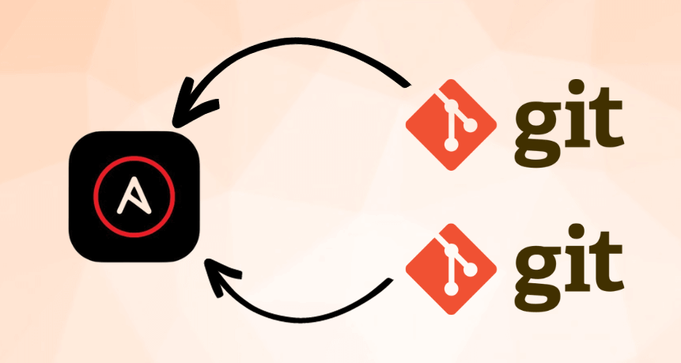

---

# Git Integration with Ansible

* In this section, we will cover [**Git integration with Ansible**](https://docs.ansible.com/ansible/latest/collections/ansible/builtin/git_module.html).
* We will learn how to automate **Git** operations on remote servers using **Ansible** playbooks.
* This is useful for deploying code, managing repositories, and keeping your infrastructure up to date.
* 

## What will we learn?

- How to use the `ansible.builtin.git` module
- How to clone, update, and manage Git repositories with Ansible
- How to work with branches, tags, and commits
- How to handle authentication and SSH keys for private repositories

---

## Prerequisites

- Complete the [previous lab](../005-facts/README.md) in order to have `Ansible` set up.
- Git installed on the managed hosts

---

## 01. Git Module Basics

- Ansible provides the `ansible.builtin.git` module to manage Git repositories on remote hosts.
- The module supports cloning, pulling, checking out branches/tags, and more.
- Key parameters:

  | Parameter | Description                                                     |
  | --------- | --------------------------------------------------------------- |
  | `repo`    | URL of the Git repository                                       |
  | `dest`    | Destination path on the remote host                             |
  | `version` | Branch, tag, or commit to checkout (default: HEAD)              |
  | `force`   | Force checkout/update even if working directory is dirty        |
  | `update`  | Pull latest changes if repository already exists (default: yes) |
  | `clone`   | Perform clone operation (default: yes)                          |
  - For more details, refer to the [Ansible Git module documentation](https://docs.ansible.com/ansible/latest/collections/ansible/builtin/git_module.html).

---

#### Ansible Git `ansible.builtin.git` examples:

## 02. Cloning Repositories

- Use the `git` module to clone a repository to a remote server.
- Specify the `repo` and `dest` parameters.
- If the repository already exists at the destination, it will not be cloned again unless `force` is set to `yes`.
- By default, the latest commit from the default branch is checked out.
  - ##### Example: Cloning git repository

  ```yaml
  ---
  - hosts: all
    tasks:
      - name: Clone a public Git repository
        ansible.builtin.git:
          repo: "https://github.com/octocat/Hello-World.git"
          dest: /opt/hello-world
  ```

  - ##### Example: Cloning with Specific Branch

  ```yaml
  ---
  - hosts: all
    tasks:
      - name: Clone repository and checkout specific branch
        ansible.builtin.git:
          repo: "https://github.com/example/repo.git"
          dest: /opt/myapp
          version: develop
  ```

---

## 03. Updating Repositories

- The `git` module automatically pulls changes if the repository exists and `update` is true.
- Use `force: yes` to overwrite local changes.
  - ##### Example: Pull Latest Changes

  ```yaml
  - hosts: all
    tasks:
      - name: Update repository to latest commit
        ansible.builtin.git:
          repo: "https://github.com/example/repo.git"
          dest: /opt/myapp
          update: yes
          force: yes
  ```

---

## 04. Branches and Tags

- Use the `version` parameter to checkout specific branches, tags, or commits.
  - ##### Example: Checkout a Tag

    ```yaml
    - hosts: all
      tasks:
        - name: Checkout specific tag
          ansible.builtin.git:
            repo: "https://github.com/example/repo.git"
            dest: /opt/myapp
            version: v1.0.0
    ```

  - ##### Example: Switch Branches

    ```yaml
    - hosts: all
      tasks:
        - name: Switch to main branch
          ansible.builtin.git:
            repo: "https://github.com/example/repo.git"
            dest: /opt/myapp
            version: main
    ```

  - ##### Example: List Git Branches

    ```yaml
    - hosts: all
      tasks:
        - name: List all branches
          ansible.builtin.command:
            cmd: git branch -a
            chdir: /opt/myapp
          register: git_branches

        - name: Display branches
          ansible.builtin.debug:
            var: git_branches.stdout_lines

        - name: Get current branch
          ansible.builtin.command:
            cmd: git rev-parse --abbrev-ref HEAD
            chdir: /opt/myapp
          register: current_branch

        - name: Show current branch
          ansible.builtin.debug:
            msg: "Current branch is: {{ current_branch.stdout }}"
    ```

  - ##### Example: Create a Git Tag

    ```yaml
    - hosts: all
      tasks:
        - name: Create an annotated tag
          ansible.builtin.shell:
            cmd: git tag -a v1.2.0 -m "Release version 1.2.0"
            chdir: /opt/myapp

        - name: Push tag to remote repository
          ansible.builtin.shell:
            cmd: git push origin v1.2.0
            chdir: /opt/myapp
    ```

  - ##### Example: List Git Tags

    ```yaml
    - hosts: all
      tasks:
        - name: List all tags in repository
          ansible.builtin.command:
            cmd: git tag
            chdir: /opt/myapp
          register: git_tags

        - name: Display tags
          ansible.builtin.debug:
            var: git_tags.stdout_lines

        - name: List tags with details
          ansible.builtin.shell:
            cmd: git tag -n
            chdir: /opt/myapp
          register: git_tags_detailed

        - name: Show detailed tag information
          ansible.builtin.debug:
            var: git_tags_detailed.stdout_lines
    ```

---

## 05. Authentication and SSH

- For private repositories, use SSH keys or HTTPS with credentials.
- Ensure SSH keys are properly configured on the Ansible controller and remote hosts.
  - ##### Example: Using SSH Key

    ```yaml
    - hosts: all
      tasks:
        - name: Clone private repo using SSH
          ansible.builtin.git:
            repo: "git@github.com:example/private-repo.git"
            dest: /opt/private-app
            key_file: /home/ansible/.ssh/id_rsa
    ```

  - ##### Example: Using HTTPS with Token

    ```yaml
    - hosts: all
      vars:
        git_token: "{{ lookup('env', 'GIT_TOKEN') }}"
      tasks:
        - name: Clone with HTTPS authentication
          ansible.builtin.git:
            repo: "https://{{ git_token }}@github.com/example/repo.git"
            dest: /opt/myapp
    ```

  - ##### Example: Generate and Deploy SSH Key

    ```yaml
    - hosts: all
      tasks:
        - name: Generate SSH key pair
          ansible.builtin.openssh_keypair:
            path: /home/ansible/.ssh/id_rsa
            type: rsa
            size: 4096
            state: present
            force: no

        - name: Read public key
          ansible.builtin.slurp:
            src: /home/ansible/.ssh/id_rsa.pub
          register: ssh_pub_key

        - name: Display public key for GitHub
          ansible.builtin.debug:
            msg: "Add this key to GitHub: {{ ssh_pub_key['content'] | b64decode }}"
    ```

  - ##### Example: Configure SSH for GitHub

    ```yaml
    - hosts: all
      tasks:
        - name: Create SSH config directory
          ansible.builtin.file:
            path: /home/ansible/.ssh
            state: directory
            mode: "0700"

        - name: Add GitHub to known_hosts
          ansible.builtin.known_hosts:
            name: github.com
            key: "{{ lookup('pipe', 'ssh-keyscan -t rsa github.com') }}"
            path: /home/ansible/.ssh/known_hosts
            state: present

        - name: Create SSH config for GitHub
          ansible.builtin.copy:
            dest: /home/ansible/.ssh/config
            mode: "0600"
            content: |
              Host github.com
                HostName github.com
                User git
                IdentityFile /home/ansible/.ssh/id_rsa
                StrictHostKeyChecking no
    ```

  - ##### Example: Clone Multiple Private Repos with Same Key

    ```yaml
    - hosts: all
      vars:
        repos:
          - { repo: "git@github.com:example/repo1.git", dest: "/opt/repo1" }
          - { repo: "git@github.com:example/repo2.git", dest: "/opt/repo2" }
          - { repo: "git@github.com:example/repo3.git", dest: "/opt/repo3" }
      tasks:
        - name: Clone multiple private repositories
          ansible.builtin.git:
            repo: "{{ item.repo }}"
            dest: "{{ item.dest }}"
            key_file: /home/ansible/.ssh/id_rsa
            accept_hostkey: yes
          loop: "{{ repos }}"
    ```

  - ##### Example: Use SSH Agent for Authentication

    ```yaml
    - hosts: all
      tasks:
        - name: Start ssh-agent and add key
          ansible.builtin.shell: |
            eval $(ssh-agent -s)
            ssh-add /home/ansible/.ssh/id_rsa
          args:
            executable: /bin/bash

        - name: Clone repository using ssh-agent
          ansible.builtin.git:
            repo: "git@github.com:example/private-repo.git"
            dest: /opt/myapp
            accept_hostkey: yes
    ```

---

## 06. Common Patterns and Best Practices

- Always use absolute paths for `dest`.
- Handle idempotency by letting the module manage updates.
- Use `force: yes` carefully as it can overwrite changes.
- Store sensitive information like tokens in Ansible Vault.
  - ##### Example: Idempotent Deployment

    ```yaml
    - hosts: all
      tasks:
        - name: Ensure application is at latest version
          ansible.builtin.git:
            repo: "https://github.com/example/app.git"
            dest: /opt/myapp
            version: main
          register: git_result

        - name: Restart service if code changed
          ansible.builtin.service:
            name: myapp
            state: restarted
          when: git_result.changed
    ```

---

## 07. Hands-on


<br/>

- Clone a public Git repository to `/opt/hello-world` on your target servers.

  ??? success "Optional Solution"
  `yaml
    - hosts: all
      tasks:
        - name: Clone Hello World repository
          ansible.builtin.git:
            repo: "https://github.com/octocat/Hello-World.git"
            dest: /opt/hello-world
    `

- Create a playbook that clones a repository and checks out a specific branch called `develop`.

  ??? success "Optional Solution"
  `yaml
    - hosts: all
      tasks:
        - name: Clone and checkout develop branch
          ansible.builtin.git:
            repo: "https://github.com/example/repo.git"
            dest: /opt/myapp
            version: develop
    `

- Write a playbook that updates an existing repository to the latest commit on the main branch.

  ??? success "Optional Solution"
  `yaml
    - hosts: all
      tasks:
        - name: Update repository to latest main
          ansible.builtin.git:
            repo: "https://github.com/example/repo.git"
            dest: /opt/myapp
            version: main
            update: yes
    `

- Create a playbook that checks out a specific tag (e.g., `v1.0.0`) from a repository.

  ??? success "Optional Solution"
  `yaml
    - hosts: all
      tasks:
        - name: Checkout specific tag
          ansible.builtin.git:
            repo: "https://github.com/example/repo.git"
            dest: /opt/myapp
            version: v1.0.0
    `

- Modify a playbook to force update a repository, overwriting any local changes.

  ??? success "Optional Solution"
  `yaml
    - hosts: all
      tasks:
        - name: Force update repository
          ansible.builtin.git:
            repo: "https://github.com/example/repo.git"
            dest: /opt/myapp
            force: yes
    `

- Create a playbook that clones a repository and restarts a service if the code was updated.

  ??? success "Optional Solution"
  ```yaml - hosts: all
  tasks: - name: Deploy application
  ansible.builtin.git:
  repo: "https://github.com/example/app.git"
  dest: /opt/myapp
  register: git_deploy

          - name: Restart service if changed
            ansible.builtin.service:
              name: myapp
              state: restarted
            when: git_deploy.changed
      ```

- Set up SSH key authentication for cloning a private repository.

  ??? success "Optional Solution"
  First, ensure SSH key is copied to the remote host:

      ```yaml
      - hosts: all
        tasks:
          - name: Copy SSH private key
            ansible.builtin.copy:
              src: ~/.ssh/id_rsa
              dest: /home/ansible/.ssh/id_rsa
              mode: "0600"

          - name: Clone private repository
            ansible.builtin.git:
              repo: "git@github.com:example/private-repo.git"
              dest: /opt/private-app
              key_file: /home/ansible/.ssh/id_rsa
      ```

---

## 08. Summary

- Use `ansible.builtin.git` module for Git operations in playbooks.
- Supports cloning, pulling, and checking out branches/tags.
- Ensure proper authentication for private repositories.
- Leverage idempotency for safe repeated runs.
- Combine with other modules for complete deployment workflows.
