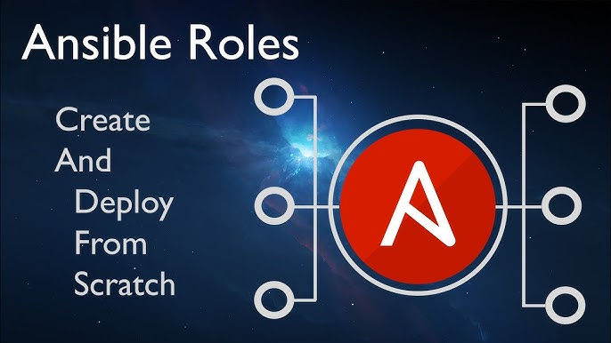
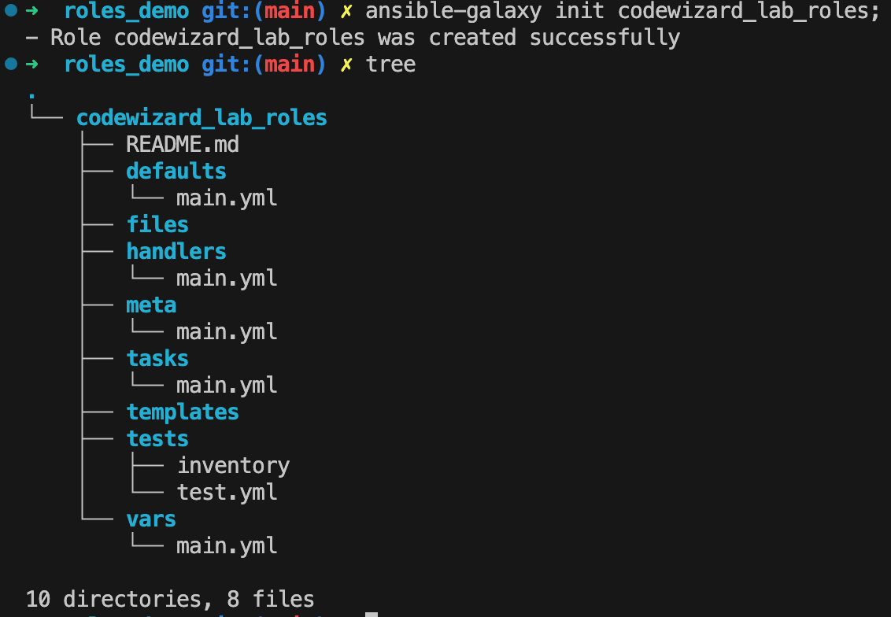

<a href="https://github.com/nirgeier/AnsibleLabs/actions/workflows/Lab-009.yaml" target="_blank">
  
</a>

---

# Lab 009 - Roles

## 01. What are Ansible roles?

- Roles let you **automatically load** related `vars`, `files`, `tasks`, `handlers`, and other Ansible artifacts based on a **known file structure**. 
- After you group your content into roles, you can easily reuse them and share them with other users.
- By default, Ansible will look in **each directory** within a role for the file names `main`/`main.yml`/`main.yaml`.


 
  <br/>

---

## 02. Ansible roles file structure

| Files         | <u>Description</u>                                                                                                                                                                                                                             |
| ------------- | -------------------------------------------------------------------------------------------------------------------------------------------------------------------------------------------------------------------------------------- |
| **tasks**     | the main list of tasks that the role executes                                                                                                                                                                                         |
| **handlers**  | handlers, which may be used within or outside this role                                                                                                                                                                               |
| **library**   | modules, which may be used within this role (see [Embedding modules and plugins in roles](https://docs.ansible.com/ansible/latest/playbook_guide/playbooks_reuse_roles.html#embedding-modules-and-plugins-in-roles) for more information)                                                                                                                         |
| **defaults**  | default variables for the role (see [Using Variables](https://docs.ansible.com/ansible/latest/playbook_guide/playbooks_variables.html) for more information) <br/>these variables have the lowest priority of any variables available and can be easily overridden by any other variable, including `inventory variables` |
| **vars**      | other variables for the role (see [Using Variables](https://docs.ansible.com/ansible/latest/playbook_guide/playbooks_variables.html) for more information)                                                                                                                                                               |
| **files**     | files that the role deploys                                                                                                                                                                                                           |
| **templates** | templates that the role deploys                                                                                                                                                                                                       |
| **meta**      | metadata for the role, including role dependencies and optional Galaxy metadata, such as supported platforms     |

---

## 03. Building an Ansible role

- In this demo we will create a role for deploying a `nodeJS` app.
- The app will be deployed from a pre-defined code.
- Each server will be deployed with its own configuration (values).
- We will also deploy some other files for learning purposes.

---

## 04. Initialize file structure

```sh
# Lets create the roles file structure
ansible-galaxy init codewizard_lab_role
```
 <br/>
- The file system of the role will look like:


 <br/>

## 05. Create the role content

- #### Create the `defaults/main.yml`
  
  ```yaml
  ---
  ### defaults/main.yml
  ###
  ### This file contains the variables for the Demo lab
  ###

  # Defaults file for codewizard_lab_role
  motd_message: "Welcome to Ansible Roles Lab"

  ### The packages we wish to install on the servers
  apt_packages:
    - python3
    - nodejs
    - npm

  # Packages to verify that they were installed
  apt_packages_verify:
    - python3
    - npm

  package_state: latest
  ```


- #### Create the templates

-- templates/motd.j2
  ```yaml
  ### templates/motd.j2

  _____             _          _    _  _                      _ 
  /  __ \           | |        | |  | |(_)                    | |
  | /  \/  ___    __| |  ___   | |  | | _  ____ __ _  _ __  __| |
  | |     / _ \  / _` | / _ \  | |/\| || ||_  // _` || '__|/ _` |
  | \__/\| (_) || (_| ||  __/  \  /\  /| | / /| (_| || |  | (_| |
  \____/ \___/  \__,_| \___|   \/  \/ |_|/___|\__,_||_|   \__,_|
  
  {{ motd_message }}

  System information:
  -------------------

  OS:         {{ ansible_distribution }} {{ ansible_distribution_version }}
  Hostname:   {{ inventory_hostname }}

  {{ custom_message | default('') }}
  ```

 <br/>

-- templates/node-server.j2
  ```yaml
  ### templates/node-server.j2
  const
      // Set the server port which will be listening to
      // Those 2 values are passed from the env file
      SERVER_PORT = 5000,
      SERVER_NAME = "{{ inventory_hostname }}";

  // Create the basic http server
  require('http')
      .createServer((request, response) => {

          // Send reply to user
          response.end(`<h1>Hello from ${SERVER_NAME}.</h1>`);

      }).listen(SERVER_PORT, () => {
          // Notify users that the server is up and running
          console.log(`${SERVER_NAME} is up. 
              Please click or point your browser to:
              http://localhost:${SERVER_PORT}`);
      });
  ```

- #### Create the tasks for the role

- In this example we will have multiple tasks for learning purposes.
- We will need to create the tasks for each role.
- Once the tasks are ready, we can define them in the main task file.

--- tasks/pre-requirements.yaml
  ```yaml 
  ### tasks/pre-requirements.yaml
  ---
  - name: Install Packages
    ansible.builtin.apt:
      name: "{{ item }}"
      state: "{{ package_state }}"
    # Loop over the required packages to install
    with_items: "{{ apt_packages }}"

  - name: Verify Packages Installation
    ansible.builtin.command: "{{ item }} --version"
    register: packages_version
    with_items: "{{ apt_packages_verify }}"

  - name: Print package version
    ansible.builtin.debug:
      msg: "{{ item.stdout_lines  }}"
    with_items: "{{ packages_version.results }}"
  ```

--- tasks/node-server.yaml

```yaml 
  ### tasks/node-server.yaml
  ---
  - name: Copy Node server
    ansible.builtin.template:
      src: templates/node-server.j2
      dest: /node-server.js
      mode: 600
    become: true
    become_method: ansible.builtin.su

  - name: Install "pm2" node.js package.
    community.general.npm:
      name: "pm2"
      global: true
    become: true
    become_method: ansible.builtin.su

  - name: Get running node processes
    shell: "ps -ef | grep -v grep | grep -w node | awk '{print $2}'"
    register: running_processes

  - name: Kill running node server (if any)
    shell: "kill {{ item }}"
    with_items: "{{ running_processes.stdout_lines }}"

  - name: Wait for the process to die
    wait_for:
      path: "/proc/{{ item }}/status"
      state: absent
    with_items: "{{ running_processes.stdout_lines }}"
    ignore_errors: true
    register: killed_processes

  - name: Force kill stuck processes
    shell: "kill -9 {{ item }}"
    with_items: "{{ killed_processes.results | select('failed') | map(attribute='item') | list }}"

  - name: Start Node server
    ansible.builtin.command:
      chdir: /
      cmd: "pm2 start -f /node-server.js"
    register: server_status
    changed_when: server_status.rc != 0

  - name: Print server status
    ansible.builtin.debug:
      msg: "{{ server_status.stdout_lines }}"
    when: server_status.rc == 0

  - name: Check server
    uri:
      url: http://localhost:5000
      method: GET
      status_code: 200
    register: server_status

  - name: Print server status
    ansible.builtin.debug:
      msg: "{{ server_status.status }} - {{ server_status.msg }}"
```

--- tasks/motd.yaml
  ```yaml
    ### tasks/motd.j2
    ---
    - name: Copy template
      ansible.builtin.template:
        src: templates/motd.j2
        dest: /etc/motd
        mode: preserve
      become: true
      become_method: ansible.builtin.su
  ```

--- tasks/main.yml

  ```yaml
    ### tasks/main.yml
    ---
    - name: Include Pre-Requirements task
      ansible.builtin.include_tasks:
        file: pre-requirements.yaml

    - name: Include motd task
      ansible.builtin.include_tasks:
        file: motd.yaml

    - name: Deploy node server
      ansible.builtin.include_tasks:
        file: node-server.yaml
  ```        

 <br/>

- #### Create the playbook for the role


  ```yaml
  ### 009-role-playbook.yml
  ---
  ###
  ### The playbook for using our role
  ### 
  - name: Executing codewizard_lab_role
    hosts: all
    become: true
    become_method: ansible.builtin.su

    roles:
      - codewizard_lab_role  
  ```

