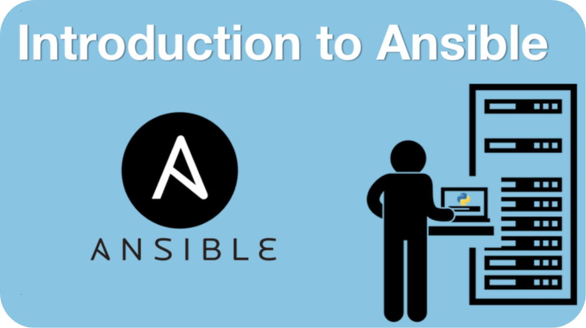

<!-- header start -->

<a href="https://stackoverflow.com/users/1755598/codewizard"></a>&emsp;&emsp;[](https://www.linkedin.com/in/nirgeier/)&emsp;[](mailto:nirgeier@gmail.com)&emsp;[](mailto:nirg@codewizard.co.il)

<!-- header end -->

[](https://hub.docker.com/r/nirgeier/ansible-labs)
[](https://github.com/nirgeier/AnsibleLabs/pkgs/container/ansible-labs)
[](https://killercoda.com/codewizard/scenario/AnsibleLabs)

---

# Ansible Hands-on Repository

- A collection of Hands-on labs for Ansible.
- Each lab builds on the previous one, guiding you from basic setup to advanced automation.

---



## [🚀 Interactive Labs & Documentation](https://nirgeier.github.io/AnsibleLabs/)

---

<!-- Labs list start -->

| Lab                                               | Topic                  | Description                                                     | Build Status                                                                                                                                                                                               |
| ------------------------------------------------- | ---------------------- | --------------------------------------------------------------- | ---------------------------------------------------------------------------------------------------------------------------------------------------------------------------------------------------------- |
| [000](Labs/000-setup/README.md)                   | Setup                  | Build Docker containers for Ansible labs                        | [](https://github.com/nirgeier/AnsibleLabs/actions/workflows/000-setup.yaml)                                     |
| [001](Labs/001-verify-ansible/README.md)          | Verify Ansible         | Configure ansible.cfg, verify connectivity with ping            | [](https://github.com/nirgeier/AnsibleLabs/actions/workflows/001-verify-ansible.yaml)                   |
| [002](Labs/002-no-inventory/README.md)            | Inventory              | Create inventory files, static and dynamic inventory types      | [](https://github.com/nirgeier/AnsibleLabs/actions/workflows/002-no-inventory.yaml)                       |
| [003](Labs/003-modules/README.md)                 | Modules                | Explore built-in modules, ad-hoc commands, module documentation | [](https://github.com/nirgeier/AnsibleLabs/actions/workflows/003-modules.yaml)                                 |
| [004](Labs/004-playbooks/README.md)               | Playbooks              | Write YAML playbooks, tasks, plays, and execution flow          | [](https://github.com/nirgeier/AnsibleLabs/actions/workflows/004-playbooks.yaml)                             |
| [005](Labs/005-facts/README.md)                   | Facts                  | Gather host facts, use facts in playbooks, custom facts         | [](https://github.com/nirgeier/AnsibleLabs/actions/workflows/005-facts.yaml)                                     |
| [006](Labs/006-git/README.md)                     | Git Module             | Clone and manage Git repositories with the git module           | [](https://github.com/nirgeier/AnsibleLabs/actions/workflows/006-git.yaml)                                         |
| [007](Labs/007-create-user/README.md)             | User Management        | Create users, manage passwords and SSH keys                     | [](https://github.com/nirgeier/AnsibleLabs/actions/workflows/007-create-user.yaml)                         |
| [008](Labs/008-challenges/README.md)              | Challenges             | Practice exercises combining previous lab concepts              |                                                                                                                                                                                                            |
| [009](Labs/009-roles/README.md)                   | Roles                  | Structure playbooks into reusable roles with galaxy init        | [](https://github.com/nirgeier/AnsibleLabs/actions/workflows/009-roles.yaml)                                     |
| [010](Labs/010-loops-and-conditionals/README.md)  | Loops & Conditionals   | Iterate with loops, apply conditionals with `when`              | [](https://github.com/nirgeier/AnsibleLabs/actions/workflows/010-loops-and-conditionals.yaml)   |
| [011](Labs/011-jinja-templating/README.md)        | Jinja2 Templates       | Create dynamic templates with filters, loops, and conditionals  | [](https://github.com/nirgeier/AnsibleLabs/actions/workflows/011-jinja-templating.yaml)               |
| [012](Labs/012-host-group-variables/README.md)    | Host & Group Variables | Set per-host and per-group variables in inventory               | [](https://github.com/nirgeier/AnsibleLabs/actions/workflows/012-host-group-variables.yaml)       |
| [013](Labs/013-adhoc-commands/README.md)          | Ad-Hoc Commands        | Run one-off commands without writing a playbook                 | [](https://github.com/nirgeier/AnsibleLabs/actions/workflows/013-adhoc-commands.yaml)                   |
| [014](Labs/014-playbook-variables/README.md)      | Playbook Variables     | Define, override, and use variables in playbooks                | [](https://github.com/nirgeier/AnsibleLabs/actions/workflows/014-playbook-variables.yaml)           |
| [015](Labs/015-handlers-blocks/README.md)         | Handlers & Blocks      | Trigger handlers on change, group tasks with blocks             | [](https://github.com/nirgeier/AnsibleLabs/actions/workflows/015-handlers-blocks.yaml)                 |
| [016](Labs/016-file-modules/README.md)            | File Modules           | Manage files, directories, links, and permissions               | [](https://github.com/nirgeier/AnsibleLabs/actions/workflows/016-file-modules.yaml)                       |
| [017](Labs/017-package-service-modules/README.md) | Package & Service      | Install packages and manage services across distros             | [](https://github.com/nirgeier/AnsibleLabs/actions/workflows/017-package-service-modules.yaml) |
| [018](Labs/018-galaxy-collections/README.md)      | Galaxy & Collections   | Install roles and collections from Ansible Galaxy               | [](https://github.com/nirgeier/AnsibleLabs/actions/workflows/018-galaxy-collections.yaml)           |
| [019](Labs/019-ansible-vault/README.md)           | Ansible Vault          | Encrypt secrets, use vault passwords in playbooks               | [](https://github.com/nirgeier/AnsibleLabs/actions/workflows/019-ansible-vault.yaml)                     |
| [020](Labs/020-tags/README.md)                    | Tags                   | Selectively run tasks with tags and skip-tags                   | [](https://github.com/nirgeier/AnsibleLabs/actions/workflows/020-tags.yaml)                                       |
| [021](Labs/021-ansible-docker/README.md)          | Ansible with Docker    | Manage Docker containers and images via Ansible                 | [](https://github.com/nirgeier/AnsibleLabs/actions/workflows/021-ansible-docker.yaml)                   |
| [022](Labs/022-debugging/README.md)               | Debugging              | Use debug module, verbosity, and register to troubleshoot       | [](https://github.com/nirgeier/AnsibleLabs/actions/workflows/022-debugging.yaml)                             |
| [023](Labs/023-idempotency/README.md)             | Idempotency            | Write idempotent tasks, understand changed vs ok states         | [](https://github.com/nirgeier/AnsibleLabs/actions/workflows/023-idempotency.yaml)                         |
| [024](Labs/024-ansible-lint/README.md)            | Ansible Lint           | Lint playbooks for best practices and style issues              | [](https://github.com/nirgeier/AnsibleLabs/actions/workflows/024-ansible-lint.yaml)                       |
| [025](Labs/025-cicd-jenkins/README.md)            | CI/CD Jenkins          | Integrate Ansible playbooks into Jenkins pipelines              | [](https://github.com/nirgeier/AnsibleLabs/actions/workflows/025-cicd-jenkins.yaml)                       |
| [026](Labs/026-cicd-github-actions/README.md)     | CI/CD GitHub Actions   | Run Ansible in GitHub Actions workflows                         | [](https://github.com/nirgeier/AnsibleLabs/actions/workflows/026-cicd-github-actions.yaml)         |
| [027](Labs/027-cicd-gitlab/README.md)             | CI/CD GitLab           | Integrate Ansible with GitLab CI/CD pipelines                   | [](https://github.com/nirgeier/AnsibleLabs/actions/workflows/027-cicd-gitlab.yaml)                         |
| [028](Labs/028-custom-modules/README.md)          | Custom Modules         | Write Python-based custom Ansible modules                       | [](https://github.com/nirgeier/AnsibleLabs/actions/workflows/028-custom-modules.yaml)                   |
| [029](Labs/029-advanced-execution/README.md)      | Advanced Execution     | Strategies, forks, async tasks, and run options                 | [](https://github.com/nirgeier/AnsibleLabs/actions/workflows/029-advanced-execution.yaml)           |
| [030](Labs/030-awx-aap/README.md)                 | AWX / AAP              | Job Templates, Workflows, and RBAC in AWX and AAP               | [](https://github.com/nirgeier/AnsibleLabs/actions/workflows/030-awx-aap.yaml)                                 |
| [031](Labs/031-facts-deep-dive/README.md)         | Facts Deep Dive        | Magic variables, set_fact, cached facts, and fact filtering     | [](https://github.com/nirgeier/AnsibleLabs/actions/workflows/031-facts-deep-dive.yaml)                 |
| [032](Labs/032-plugins/README.md)                 | Plugins                | Callback, lookup, filter, and connection plugins                | [](https://github.com/nirgeier/AnsibleLabs/actions/workflows/032-plugins.yaml)                                 |
| [033](Labs/033-best-practices/README.md)          | Best Practices         | Directory layout, naming, tagging, and security guidelines      | [](https://github.com/nirgeier/AnsibleLabs/actions/workflows/033-best-practices.yaml)                   |
| [034](Labs/034-security-hardening/README.md)      | Security Hardening     | Harden Linux systems with Ansible playbooks                     | [](https://github.com/nirgeier/AnsibleLabs/actions/workflows/034-security-hardening.yaml)           |
| [035](Labs/035-cloud-modules/README.md)           | Cloud Modules          | Manage AWS, GCP, and Azure resources with Ansible               | [](https://github.com/nirgeier/AnsibleLabs/actions/workflows/035-cloud-modules.yaml)                     |

<!-- Labs list ends -->

---

## Getting Started

### Option 1 - Killercoda (No Install Required)

[](https://killercoda.com/codewizard/scenario/AnsibleLabs)

No installation required - runs entirely in your browser with all tools pre-installed.

### Option 2 - Docker Compose (Full Environment)

Ansible Labs use multiple containers (controller + 3 target servers). Use Docker Compose for the full interactive environment:

```bash
git clone https://github.com/nirgeier/AnsibleLabs
cd AnsibleLabs
docker compose -f docker/docker-compose.yml up -d
```

Open [http://localhost:3000](http://localhost:3000) - left pane shows the MkDocs documentation, right pane has tabs for the Ansible controller and all three target servers.

### Option 3 - Docker (Web UI only)

```bash
# From GHCR (recommended)
docker run -d --name ansible-labs -p 3000:3000 ghcr.io/nirgeier/ansible-labs:latest

# From Docker Hub
docker run -d --name ansible-labs -p 3000:3000 nirgeier/ansible-labs:latest
```

Open [http://localhost:3000](http://localhost:3000) in your browser.

### Option 4 - From Source

```bash
git clone https://github.com/nirgeier/AnsibleLabs
cd AnsibleLabs/Labs/000-setup
bash _demo.sh
```
